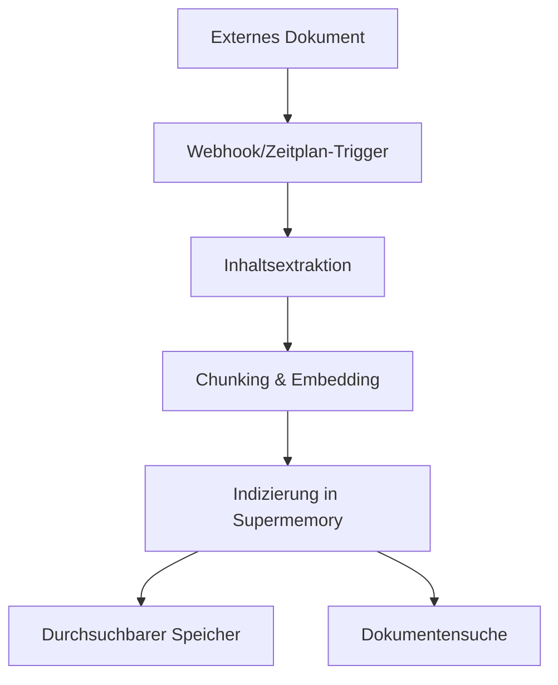

Externe Plattformen verbinden, um documents automatisch mit Supermemory zu synchronisieren. Unterstützte Connectors sind Google Drive, Notion und OneDrive mit Echtzeit-Synchronisierung und intelligenter Inhaltsverarbeitung.

<div id="supported-connectors">
  ## Unterstützte Connectors
</div>

<CardGroup cols={3}>
  <Card title="Google Drive" icon="google-drive" href="/de/connectors/google-drive">
    **Google Docs, Slides, Sheets**

    Echtzeit-Synchronisierung über Webhooks. Unterstützt geteilte Laufwerke, verschachtelte Ordner und kollaborative Dokumente.
  </Card>

  <Card title="Notion" icon="notion" href="/de/connectors/notion">
    **Seiten, Datenbanken, Blöcke**

    Sofortige Synchronisierung von Workspace-Inhalten. Verarbeitet umfangreiche Formatierungen, Einbettungen und Datenbankeigenschaften.
  </Card>

  <Card title="OneDrive" icon="microsoft" href="/de/connectors/onedrive">
    **Word, Excel, PowerPoint**

    Geplante Synchronisierung alle 4 Stunden. Unterstützt persönliche und geschäftliche Konten inklusive Dateiversionierung.
  </Card>
</CardGroup>

<div id="quick-start">
  ## Schnellstart
</div>

<div id="1-create-connection">
  ### 1. Verbindung erstellen
</div>

<CodeGroup>
  ```typescript Typescript
  import Supermemory from 'supermemory';

  const client = new Supermemory({
    apiKey: process.env.SUPERMEMORY_API_KEY!
  });

  const connection = await client.connections.create('notion', {
    redirectUrl: 'https://yourapp.com/callback',
    containerTags: ['user-123', 'workspace-alpha'],
    documentLimit: 5000,
    metadata: { department: 'sales' }
  });

  // Benutzer weiterleiten, um OAuth abzuschließen
  console.log('Auth-URL:', connection.authLink);
  console.log('Gültig für:', connection.expiresIn);
  // Ausgabe: Auth-URL: https://api.notion.com/v1/oauth/authorize?...
  // Ausgabe: Gültig für: 1 Stunde
  ```

  ```python Python
  from supermemory import Supermemory
  import os

  client = Supermemory(api_key=os.environ.get("SUPERMEMORY_API_KEY"))

  connection = client.connections.create(
      'notion',
      redirect_url='https://yourapp.com/callback',
      container_tags=['user-123', 'workspace-alpha'],
      document_limit=5000,
      metadata={'department': 'sales'}
  )

  # Benutzer weiterleiten, um OAuth abzuschließen
  print(f'Auth-URL: {connection.auth_link}')
  print(f'Gültig für: {connection.expires_in}')
  # Ausgabe: Auth-URL: https://api.notion.com/v1/oauth/authorize?...
  # Ausgabe: Gültig für: 1 Stunde
  ```

  ```bash cURL
  curl -X POST "https://api.supermemory.ai/v3/connections/notion" \
    -H "Authorization: Bearer $SUPERMEMORY_API_KEY" \
    -H "Content-Type: application/json" \
    -d '{
      "redirectUrl": "https://yourapp.com/callback",
      "containerTags": ["user-123", "workspace-alpha"],
      "documentLimit": 5000,
      "metadata": {"department": "sales"}
    }'

  # Antwort: {
  #   "authLink": "https://api.notion.com/v1/oauth/authorize?...",
  #   "expiresIn": "1 hour",
  #   "id": "conn_abc123",
  #   "redirectsTo": "https://yourapp.com/callback"
  # }
  ```
</CodeGroup>

<div id="2-handle-oauth-callback">
  ### 2. OAuth-Callback verarbeiten
</div>

Nachdem der/die Nutzer:in den OAuth-Vorgang abgeschlossen hat, wird das verknüpfte Konto automatisch eingerichtet und die Synchronisierung startet.

<div id="3-monitor-sync-status">
  ### 3. Synchronisationsstatus überwachen
</div>

<CodeGroup>
  ```typescript Typescript
  import Supermemory from 'supermemory';

  const client = new Supermemory({
    apiKey: process.env.SUPERMEMORY_API_KEY!
  });

  // Alle verknüpften Konten mit dem SDK auflisten
  const connections = await client.connections.list({
    containerTags: ['user-123', 'workspace-alpha']
  });

  connections.forEach(conn => {
    console.log('Verknüpftes Konto:', conn.id);
    console.log('Provider:', conn.provider);
    console.log('E-Mail:', conn.email);
    console.log('Erstellt:', conn.createdAt);
  });

  // Synchronisierte documents (Speicher-Einträge) mit dem SDK auflisten
  const memories = await client.memories.list({
    containerTags: ['user-123', 'workspace-alpha']
  });

  console.log(`Synchronisierte ${memories.memories.length} documents`);
  // Ausgabe: Synchronisierte 45 documents
  ```

  ```python Python
  from supermemory import Supermemory
  import os

  client = Supermemory(api_key=os.environ.get("SUPERMEMORY_API_KEY"))

  # Alle verknüpften Konten mit dem SDK auflisten
  connections = client.connections.list(
      container_tags=['user-123', 'workspace-alpha']
  )

  for conn in connections:
      print(f'Verknüpftes Konto: {conn.id}')
      print(f'Provider: {conn.provider}')
      print(f'E-Mail: {conn.email}')
      print(f'Erstellt: {conn.created_at}')

  # Synchronisierte documents (Speicher-Einträge) mit dem SDK auflisten
  memories = client.memories.list(container_tags=['user-123', 'workspace-alpha'])

  print(f'Synchronisierte {len(memories.memories)} documents')
  # Ausgabe: Synchronisierte 45 documents
  ```

  ```bash cURL
  # Alle verknüpften Konten auflisten
  curl -X POST "https://api.supermemory.ai/v3/connections/list" \
    -H "Authorization: Bearer $SUPERMEMORY_API_KEY" \
    -H "Content-Type: application/json" \
    -d '{"containerTags": ["user-123", "workspace-alpha"]}'

  # Antwort: [{"id": "conn_abc", "provider": "notion", "email": "user@example.com", ...}]

  # Synchronisierte documents auflisten
  curl -X POST "https://api.supermemory.ai/v3/documents/list" \
    -H "Authorization: Bearer $SUPERMEMORY_API_KEY" \
    -H "Content-Type: application/json" \
    -d '{"containerTags": ["user-123", "workspace-alpha"]}'

  # Antwort: {"results": [...], "totalCount": 45}
  ```
</CodeGroup>

<div id="how-connectors-work">
  ## Funktionsweise von Connectors
</div>

<div id="authentication-flow">
  ### Authentifizierungsablauf
</div>

1. **Verknüpftes Konto erstellen**: `/v3/connections/{provider}` aufrufen, um die OAuth-URL zu erhalten
2. **Autorisierung durch den Nutzer**: Nutzer zum Abschluss des OAuth-Flows weiterleiten
3. **Automatische Einrichtung**: Verknüpftes Konto hergestellt, die Synchronisierung startet sofort
4. **Kontinuierliche Synchronisierung**: Echtzeit-Updates über Webhooks plus geplante Synchronisierung alle 4 Stunden

<div id="document-processing-pipeline">
  ### Pipeline zur Dokumentverarbeitung
</div>



<div id="sync-mechanisms">
  ### Synchronisierungsmechanismen
</div>

| Provider | Echtzeit-Synchronisierung | Geplante Synchronisierung | Manuelle Synchronisierung |
|----------|---------------------------|---------------------------|---------------------------|
| **Google Drive** | ✅ Webhooks (7 Tage gültig) | ✅ Alle 4 Stunden | ✅ Auf Abruf |
| **Notion** | ✅ Webhooks | ✅ Alle 4 Stunden | ✅ Auf Abruf |
| **OneDrive** | ✅ Webhooks (30 Tage gültig) | ✅ Alle 4 Stunden | ✅ Auf Abruf |

<div id="connection-management">
  ## Verwaltung verknüpfter Konten
</div>

<div id="list-all-connections">
  ### Alle Integrationen auflisten
</div>

<CodeGroup>
  ```typescript Typescript
  import Supermemory from 'supermemory';

  const client = new Supermemory({
    apiKey: process.env.SUPERMEMORY_API_KEY!
  });

  const connections = await client.connections.list({
    containerTags: ['org-123']
  });
  ```

  ```python Python
  from supermemory import Supermemory
  import os

  client = Supermemory(api_key=os.environ.get("SUPERMEMORY_API_KEY"))

  connections = client.connections.list(container_tags=['org-123'])

  for conn in connections:
      print(f"{conn.provider}: {conn.email} ({conn.id})")
      print(f"Dokumente: {conn.document_limit or 'unlimited'}")
      print(f"Ablauf: {conn.expires_at or 'never'}")
  # Ausgabe: notion: user@company.com (conn_abc123)
  # Ausgabe: Dokumente: 5000
  # Ausgabe: Ablauf: never
  ```

  ```bash cURL
  curl -X POST "https://api.supermemory.ai/v3/connections/list" \
    -H "Authorization: Bearer $SUPERMEMORY_API_KEY" \
    -H "Content-Type: application/json" \
    -d '{"containerTags": ["org-123"]}'

  # Antwort: [
  #   {
  #     "id": "conn_abc123",
  #     "provider": "notion",
  #     "email": "user@company.com",
  #     "documentLimit": 5000,
  #     "createdAt": "2024-01-15T10:30:00.000Z"
  #   }
  # ]
  ```
</CodeGroup>

<div id="delete-connections">
  ### Verknüpfte Konten löschen
</div>

<CodeGroup>
  ```typescript Typescript
  import Supermemory from 'supermemory';

  const client = new Supermemory({
    apiKey: process.env.SUPERMEMORY_API_KEY!
  });

  // Über das SDK per Verknüpfungs-ID löschen
  const result = await client.connections.delete(connectionId);

  console.log('Gelöscht:', result.id, result.provider);
  // Ausgabe: Gelöscht: conn_abc123 notion
  ```

  ```python Python
  from supermemory import Supermemory
  import os

  client = Supermemory(api_key=os.environ.get("SUPERMEMORY_API_KEY"))

  # Über das SDK per Verknüpfungs-ID löschen
  result = client.connections.delete(connection_id)

  print(f"Gelöscht: {result.id} {result.provider}")
  # Ausgabe: Gelöscht: conn_abc123 notion
  ```

  ```bash cURL
  curl -X DELETE "https://api.supermemory.ai/v3/connections/conn_abc123" \
    -H "Authorization: Bearer $SUPERMEMORY_API_KEY"

  # Antwort: {
  #   "id": "conn_abc123",
  #   "provider": "notion"
  # }
  ```
</CodeGroup>