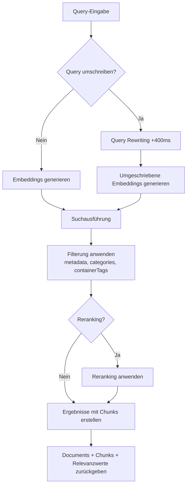
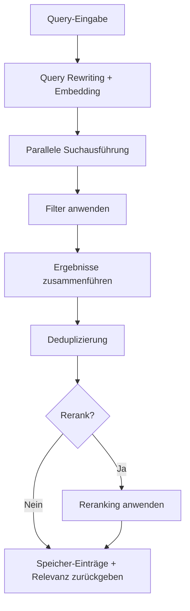

<div id="search-endpoints-overview">
  ## Übersicht der Suchendpunkte
</div>

<CardGroup cols={2}>
  <Card title="Dokumentensuche – Schnelles, leistungsfähiges RAG" icon="settings" href="/de/search/examples/document-search">
    **POST /v3/search**

    Umfassende Suche mit detaillierter Kontrolle über Ranking, Filter, threshold und Ergebnisstruktur. Durchsucht und liefert relevante documents. Mehr Flexibilität.
  </Card>

  <Card title="Speicher-Suche" icon="zap" href="/de/search/examples/memory-search">
    **POST /v4/search**

    Suche mit minimaler Latenz, optimiert für Chatbots und konversationelle KI. Durchsucht und liefert Speicher‑Einträge. Einfache Parameter, schnelle Antworten, leicht zu verwenden.
  </Card>
</CardGroup>

<div id="documents-vs-memories-search-whats-the-difference">
  ## Documents vs Memories Search: Was ist der Unterschied?
</div>

Der wichtigste Unterschied zwischen `/v3/search` und `/v4/search` ist **documents vs memories**. `/v3/search` durchsucht die documents und gibt passende Chunks zurück, während `/v4/search` die Speicher, Präferenzen und den Verlauf der Nutzer durchsucht.

* **Documents:** Beziehen sich auf die Daten, die Sie einspielen, z. B. Text, PDFs, Videos, Bilder usw. Sie sind Quellen der verlässlichen Referenz („Ground Truth“).
* **Memories:** Sie werden automatisch von Supermemory aus Ihren documents extrahiert. Kleinere Informations-Chunks, die aus documents abgeleitet und miteinander verknüpft sind.

Siehe den [Ingestion-Guide](/de/memory-api/ingesting), um mehr über den Unterschied zwischen documents und Speicher-Einträgen zu erfahren.

<div id="documents-search-v3search">
  ### Dokumentensuche (`/v3/search`)
</div>

**Hochwertige Dokumentensuche** – umfangreiche Parameter zur Feinabstimmung des Suchverhaltens:

* **Anwendungsfälle**: Verwenden Sie diesen Endpoint für Anwendungsfälle, in denen eine „wörtliche“ Dokumentensuche erforderlich ist.
  * Durchsicht von Rechts- und Finanzdokumenten
  * Suche nach Elementen in Google Drive
  * Chat mit Dokumentation
* Mit diesem Endpoint erhalten Sie **volle Kontrolle** über
  * Schwellenwerte,
  * Filterung,
  * Reranking,
  * Query Rewriting

<Tabs>
  <Tab title="TypeScript">
    ```typescript
    // Documents search
    const results = await client.search.documents({
      q: "machine learning accuracy",
      limit: 10,
      documentThreshold: 0.7,
      chunkThreshold: 0.8,
      rerank: true,
      rewriteQuery: true,
      includeFullDocs: true,
      includeSummary: true,
      onlyMatchingChunks: false,
      containerTags: ["research"],
      filters: {
        AND: [{ key: "category", value: "ai", negate: false }]
      }
    });
    ```
  </Tab>

  <Tab title="Python">
    ```python
    # Documents search
    results = client.search.documents(
        q="machine learning accuracy",
        limit=10,
        document_threshold=0.7,
        chunk_threshold=0.8,
        rerank=True,
        rewrite_query=True,
        include_full_docs=True,
        include_summary=True,
        only_matching_chunks=False,
        container_tags=["research"],
        filters={
            "AND": [{"key": "category", "value": "ai", "negate": False}]
        }
    )
    ```
  </Tab>

  <Tab title="cURL">
    ```bash
    curl -X POST "https://api.supermemory.ai/v3/search" \
      -H "Authorization: Bearer $SUPERMEMORY_API_KEY" \
      -H "Content-Type: application/json" \
      -d '{
        "q": "machine learning accuracy",
        "limit": 10,
        "documentThreshold": 0.7,
        "chunkThreshold": 0.8,
        "rerank": true,
        "rewriteQuery": true,
        "includeFullDocs": true,
        "includeSummary": true,
        "onlyMatchingChunks": false,
        "containerTags": ["research"],
        "filters": {
          "AND": [{"key": "category", "value": "ai", "negate": false}]
        }
      }'
    ```
  </Tab>
</Tabs>

```json Sample Response

{
  "results": [
    {
      "documentId": "doc_abc123",
      "title": "Grundlagen des maschinellen Lernens",
      "type": "pdf",
      "score": 0.89,
      "chunks": [
        {
          "content": "Maschinelles Lernen ist ein Teilbereich der künstlichen Intelligenz...",
          "score": 0.95,
          "isRelevant": true
        }
      ],
      "metadata": {
        "category": "bildung",
        "author": "Dr. Smith",
        "difficulty": "anfänger"
      },
      "createdAt": "2024-01-15T10:30:00Z",
      "updatedAt": "2024-01-20T14:45:00Z"
    }
  ],
  "timing": 187,
  "total": 1
}
```

Der Endpunkt `/v3/search` gibt die relevantesten documents sowie Chunks aus diesen documents zurück. Weitere Details zur Antwortstruktur finden Sie auf der Seite zum [Response-Schema](/de/search/response-schema).

<div id="memories-search-v4search">
  ### Suche in Speichern (`/v4/search`)
</div>

**Benutzer‑Speicher durchsuchen**:

* **Anwendungsfälle**: Verwende diesen Endpoint, wenn das Verständnis von Benutzerkontext, Präferenzen und Speichern wichtiger ist als die wortwörtliche Dokumentensuche.
  * Personalisierte Chatbots (AI Companions)
  * Automatische Auswahl basierend auf den Wünschen des Nutzers
  * Festlegung des Gesprächstones

Unternehmen wie Composio und [Rube.app](https://rube.app) nutzen die Speicher‑Suche, damit der MCP auf Basis früherer Benutzereingaben besser automatisieren kann.

<Info>
  Dieser Endpoint eignet sich besonders für konversationelle AI‑Anwendungsfälle wie Chatbots.
</Info>

<Tabs>
  <Tab title="TypeScript">
    ```typescript
    // Memories search
    const results = await client.search.memories({
      q: "machine learning accuracy",
      limit: 5,
      containerTag: "research",
      threshold: 0.7,
      rerank: true
    });
    ```
  </Tab>

  <Tab title="Python">
    ```python
    # Memories search
    results = client.search.memories(
        q="machine learning accuracy",
        limit=5,
        container_tag="research",
        threshold=0.7,
        rerank=True
    )
    ```
  </Tab>

  <Tab title="cURL">
    ```bash
    curl -X POST "https://api.supermemory.ai/v4/search" \
      -H "Authorization: Bearer $SUPERMEMORY_API_KEY" \
      -H "Content-Type: application/json" \
      -d '{
        "q": "machine learning accuracy",
        "limit": 5,
        "containerTag": "research",
        "threshold": 0.7,
        "rerank": true
      }'
    ```
  </Tab>
</Tabs>

```json Sample Response
{
  "results": [
    {
      "id": "mem_xyz789",
      "memory": "Vollständiger Speicherinhalt über Quantencomputing-Anwendungen...",
      "similarity": 0.87,
      "metadata": {
        "category": "research",
        "topic": "quantum-computing"
      },
      "updatedAt": "2024-01-18T09:15:00Z",
      "version": 3,
      "context": {
        "parents": [
          {
            "memory": "Frühere Diskussion über Grundlagen der Quantentheorie...",
            "relation": "extends",
            "version": 2,
            "updatedAt": "2024-01-17T16:30:00Z"
          }
        ],
        "children": [
          {
            "memory": "Anschlussfragen zu Quantenalgorithmen...",
            "relation": "derives",
            "version": 4,
            "updatedAt": "2024-01-19T11:20:00Z"
          }
        ]
      },
      "documents": [
        {
          "id": "doc_quantum_paper",
          "title": "Quantencomputing-Anwendungen",
          "type": "pdf",
          "createdAt": "2024-01-10T08:00:00Z"
        }
      ]
    }
  ],
  "timing": 156,
  "total": 1
}

```

Der Endpoint `/v4/search` durchsucht und gibt Speicher-Einträge zurück.

<div id="search-flow-architecture">
  ## Architektur des Suchflows
</div>

<div id="document-search-v3search-flow">
  ### Ablauf der Dokumentensuche (`/v3/search`)
</div>



<div id="memory-search-v4search-flow">
  ### Speicher-Suche (`/v4/search`) Ablauf
</div>



<div id="key-concepts-you-need-to-understand">
  ## Zentrale Konzepte, die Sie kennen sollten
</div>

<div id="1-thresholds-sensitivity-control">
  ### 1. Thresholds (Empfindlichkeitssteuerung)
</div>

Thresholds steuern das Verhältnis von Ergebnisqualität zu -menge:

* **0.0** = Geringste Empfindlichkeit (mehr Ergebnisse, geringere Qualität)
* **1.0** = Höchste Empfindlichkeit (weniger Ergebnisse, höhere Qualität)

```typescript
// Verschiedene threshold-Strategien
const broadSearch = await client.search.documents({
  q: "machine learning",
  chunkThreshold: 0.2,      // Mehr Chunks zurückgeben
  documentThreshold: 0.1    // Aus mehr documents
});

const preciseSearch = await client.search.documents({
  q: "machine learning",
  chunkThreshold: 0.8,      // Nur hochrelevante Chunks
  documentThreshold: 0.7    // Aus eng übereinstimmenden documents
});
```

<div id="2-chunk-context-vs-exact-matching">
  ### 2. Chunk-Kontext vs. exakte Übereinstimmung
</div>

Standardmäßig liefert Supermemory Chunks **mit Kontext** (umliegenden Text):

```typescript
// Standard: umfasst umgebende Chunks für Kontext
const contextualResults = await client.search.documents({
  q: "neural networks",
  onlyMatchingChunks: false  // Standard
});

// Präzise: nur der exakt passende Text
const exactResults = await client.search.documents({
  q: "neural networks",
  onlyMatchingChunks: true
});
```

### 3. Query Rewriting &amp; Reranking

**Query Rewriting** (+400ms Latenz):

* Erweitert die Abfrage, um mehr relevante Ergebnisse zu finden
* „ML“ wird zu „machine learning artificial intelligence“
* Nützlich bei Abkürzungen und domänenspezifischen Begriffen

**Reranking**:

* Bewertet Ergebnisse mit einem anderen Algorithmus neu
* Präziser, aber langsamer
* Empfohlen für kritische Suchen

<div id="4-container-tags-vs-metadata-filters">
  ### 4. Container-Tags vs. Metadata-Filter
</div>

Zwei unterschiedliche Filtermechanismen:

Wann Container-Tags verwenden:

* Der User-Understanding-Graph basiert auf Container-Tags. **Der Graph wird auf Container-Tags aufgebaut.**
  * Container-Tags dienen der organisatorischen Gruppierung und exakten Übereinstimmung.
  * Sie sind hilfreich, um Inhalte zu kategorisieren und präzise Ergebnisse sicherzustellen.
    Wann Metadata-Filter verwenden:
  * Wenn Sie flexible Bedingungen über exakte Übereinstimmungen hinaus benötigen.
  * Nützlich zum Filtern nach Attributen wie Datum, Autor oder Kategorie.

```typescript
// Container Tags: Organisatorische Gruppierung (exakte Array-Übereinstimmung)
const userContent = await client.search.documents({
  q: "python tutorial",
  containerTag "user_123"  // Muss exakt übereinstimmen
});

// Metadata-Filter: SQL-basierte Abfragen (flexible Bedingungen)
const filteredContent = await client.search.documents({
  q: "python tutorial",
  filters: JSON.stringify({
    AND: [
      { key: "language", value: "python", negate: false },
      { key: "difficulty", value: "beginner", negate: false }
    ]
  })
});
```
