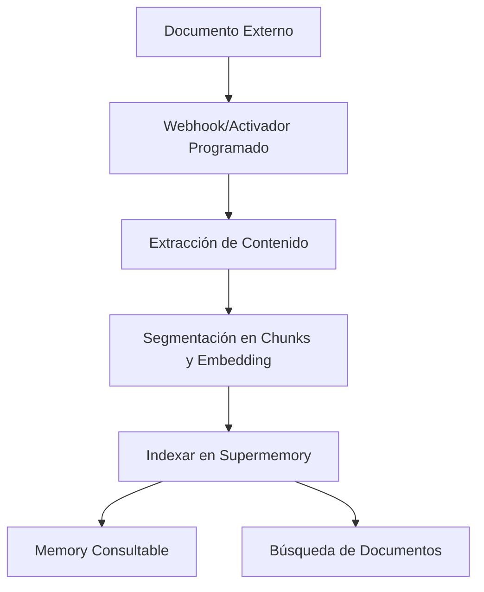

Conecta plataformas externas para sincronizar automáticamente documentos en Supermemory. Los conectores compatibles incluyen Google Drive, Notion y OneDrive, con sincronización en tiempo real y procesamiento inteligente de contenido.

<div id="supported-connectors">
  ## Conectores compatibles
</div>

<CardGroup cols={3}>
  <Card title="Google Drive" icon="google-drive" href="/es/connectors/google-drive">
    **Google Docs, Slides, Sheets**

    Sincronización en tiempo real mediante webhooks. Compatible con unidades compartidas, carpetas anidadas y documentos colaborativos.
  </Card>

  <Card title="Notion" icon="notion" href="/es/connectors/notion">
    **Páginas, bases de datos, bloques**

    Sincronización instantánea del contenido del espacio de trabajo. Admite formato enriquecido, incrustaciones y propiedades de bases de datos.
  </Card>

  <Card title="OneDrive" icon="microsoft" href="/es/connectors/onedrive">
    **Word, Excel, PowerPoint**

    Sincronización programada cada 4 horas. Compatible con cuentas personales y empresariales, con control de versiones de archivos.
  </Card>
</CardGroup>

<div id="quick-start">
  ## Guía rápida
</div>

<div id="1-create-connection">
  ### 1. Crear integración
</div>

<CodeGroup>
  ```typescript Typescript
  import Supermemory from 'supermemory';

  const client = new Supermemory({
    apiKey: process.env.SUPERMEMORY_API_KEY!
  });

  const connection = await client.connections.create('notion', {
    redirectUrl: 'https://yourapp.com/callback',
    containerTags: ['user-123', 'workspace-alpha'],
    documentLimit: 5000,
    metadata: { department: 'sales' }
  });

  // Redirigir al usuario para completar OAuth
  console.log('URL de autenticación:', connection.authLink);
  console.log('Caduca en:', connection.expiresIn);
  // Salida: URL de autenticación: https://api.notion.com/v1/oauth/authorize?...
  // Salida: Caduca en: 1 hour
  ```

  ```python Python
  from supermemory import Supermemory
  import os

  client = Supermemory(api_key=os.environ.get("SUPERMEMORY_API_KEY"))

  connection = client.connections.create(
      'notion',
      redirect_url='https://yourapp.com/callback',
      container_tags=['user-123', 'workspace-alpha'],
      document_limit=5000,
      metadata={'department': 'sales'}
  )

  # Redirigir al usuario para completar OAuth
  print(f'URL de autenticación: {connection.auth_link}')
  print(f'Caduca en: {connection.expires_in}')
  # Salida: URL de autenticación: https://api.notion.com/v1/oauth/authorize?...
  # Salida: Caduca en: 1 hour
  ```

  ```bash cURL
  curl -X POST "https://api.supermemory.ai/v3/connections/notion" \
    -H "Authorization: Bearer $SUPERMEMORY_API_KEY" \
    -H "Content-Type: application/json" \
    -d '{
      "redirectUrl": "https://yourapp.com/callback",
      "containerTags": ["user-123", "workspace-alpha"],
      "documentLimit": 5000,
      "metadata": {"department": "sales"}
    }'

  # Respuesta: {
  #   "authLink": "https://api.notion.com/v1/oauth/authorize?...",
  #   "expiresIn": "1 hour",
  #   "id": "conn_abc123",
  #   "redirectsTo": "https://yourapp.com/callback"
  # }
  ```
</CodeGroup>

<div id="2-handle-oauth-callback">
  ### 2. Gestionar el callback de OAuth
</div>

Después de que el usuario complete OAuth, la integración se establece automáticamente y comienza la sincronización.

<div id="3-monitor-sync-status">
  ### 3. Supervisar el estado de sincronización
</div>

<CodeGroup>
  ```typescript Typescript
  import Supermemory from 'supermemory';

  const client = new Supermemory({
    apiKey: process.env.SUPERMEMORY_API_KEY!
  });

  // Listar todas las integraciones con el SDK
  const connections = await client.connections.list({
    containerTags: ['user-123', 'workspace-alpha']
  });

  connections.forEach(conn => {
    console.log('Integración:', conn.id);
    console.log('Proveedor:', conn.provider);
    console.log('Correo:', conn.email);
    console.log('Creada:', conn.createdAt);
  });

  // Listar documentos sincronizados (memories) con el SDK
  const memories = await client.memories.list({
    containerTags: ['user-123', 'workspace-alpha']
  });

  console.log(`Se sincronizaron ${memories.memories.length} documentos`);
  // Salida: Se sincronizaron 45 documentos
  ```

  ```python Python
  from supermemory import Supermemory
  import os

  client = Supermemory(api_key=os.environ.get("SUPERMEMORY_API_KEY"))

  # Listar todas las integraciones con el SDK
  connections = client.connections.list(
      container_tags=['user-123', 'workspace-alpha']
  )

  for conn in connections:
      print(f'Integración: {conn.id}')
      print(f'Proveedor: {conn.provider}')
      print(f'Correo: {conn.email}')
      print(f'Creada: {conn.created_at}')

  # Listar documentos sincronizados (memories) con el SDK
  memories = client.memories.list(container_tags=['user-123', 'workspace-alpha'])

  print(f'Se sincronizaron {len(memories.memories)} documentos')
  # Salida: Se sincronizaron 45 documentos
  ```

  ```bash cURL
  # Listar todas las integraciones
  curl -X POST "https://api.supermemory.ai/v3/connections/list" \
    -H "Authorization: Bearer $SUPERMEMORY_API_KEY" \
    -H "Content-Type: application/json" \
    -d '{"containerTags": ["user-123", "workspace-alpha"]}'

  # Respuesta: [{"id": "conn_abc", "provider": "notion", "email": "user@example.com", ...}]

  # Listar documentos sincronizados
  curl -X POST "https://api.supermemory.ai/v3/documents/list" \
    -H "Authorization: Bearer $SUPERMEMORY_API_KEY" \
    -H "Content-Type: application/json" \
    -d '{"containerTags": ["user-123", "workspace-alpha"]}'

  # Respuesta: {"results": [...], "totalCount": 45}
  ```
</CodeGroup>

<div id="how-connectors-work">
  ## Cómo funcionan los conectores
</div>

<div id="authentication-flow">
  ### Flujo de autenticación
</div>

1. **Crear integración**: Llama a `/v3/connections/{provider}` para obtener la URL de OAuth
2. **Autorización del usuario**: Redirige al usuario para completar el flujo de OAuth
3. **Configuración automática**: Se establece la integración y la sincronización comienza de inmediato
4. **Sincronización continua**: Actualizaciones en tiempo real vía webhooks + sincronización programada cada 4 horas

<div id="document-processing-pipeline">
  ### Canal de procesamiento de documentos
</div>



<div id="sync-mechanisms">
  ### Mecanismos de sincronización
</div>

| Provider | Sincronización en tiempo real | Sincronización programada | Sincronización manual |
|----------|-------------------------------|---------------------------|-----------------------|
| **Google Drive** | ✅ Webhooks (vencen a los 7 días) | ✅ Cada 4 horas | ✅ A demanda |
| **Notion** | ✅ Webhooks | ✅ Cada 4 horas | ✅ A demanda |
| **OneDrive** | ✅ Webhooks (vencen a los 30 días) | ✅ Cada 4 horas | ✅ A demanda |

<div id="connection-management">
  ## Administración de integraciones
</div>

<div id="list-all-connections">
  ### Listar todas las integraciones
</div>

<CodeGroup>
  ```typescript Typescript
  import Supermemory from 'supermemory';

  const client = new Supermemory({
    apiKey: process.env.SUPERMEMORY_API_KEY!
  });

  const connections = await client.connections.list({
    containerTags: ['org-123']
  });
  ```

  ```python Python
  from supermemory import Supermemory
  import os

  client = Supermemory(api_key=os.environ.get("SUPERMEMORY_API_KEY"))

  connections = client.connections.list(container_tags=['org-123'])

  for conn in connections:
      print(f"{conn.provider}: {conn.email} ({conn.id})")
      print(f"Documentos: {conn.document_limit or 'sin límite'}")
      print(f"Vence: {conn.expires_at or 'nunca'}")
  # Salida: notion: user@company.com (conn_abc123)
  # Salida: Documentos: 5000
  # Salida: Vence: nunca
  ```

  ```bash cURL
  curl -X POST "https://api.supermemory.ai/v3/connections/list" \
    -H "Authorization: Bearer $SUPERMEMORY_API_KEY" \
    -H "Content-Type: application/json" \
    -d '{"containerTags": ["org-123"]}'

  # Respuesta: [
  #   {
  #     "id": "conn_abc123",
  #     "provider": "notion",
  #     "email": "user@company.com",
  #     "documentLimit": 5000,
  #     "createdAt": "2024-01-15T10:30:00.000Z"
  #   }
  # ]
  ```
</CodeGroup>

<div id="delete-connections">
  ### Eliminar integraciones
</div>

<CodeGroup>
  ```typescript Typescript
  import Supermemory from 'supermemory';

  const client = new Supermemory({
    apiKey: process.env.SUPERMEMORY_API_KEY!
  });

  // Eliminar por ID de integración usando el SDK
  const result = await client.connections.delete(connectionId);

  console.log('Eliminado:', result.id, result.provider);
  // Salida: Eliminado: conn_abc123 notion
  ```

  ```python Python
  from supermemory import Supermemory
  import os

  client = Supermemory(api_key=os.environ.get("SUPERMEMORY_API_KEY"))

  # Eliminar por ID de integración usando el SDK
  result = client.connections.delete(connection_id)

  print(f"Eliminado: {result.id} {result.provider}")
  # Salida: Eliminado: conn_abc123 notion
  ```

  ```bash cURL
  curl -X DELETE "https://api.supermemory.ai/v3/connections/conn_abc123" \
    -H "Authorization: Bearer $SUPERMEMORY_API_KEY"

  # Respuesta: {
  #   "id": "conn_abc123",
  #   "provider": "notion"
  # }
  ```
</CodeGroup>