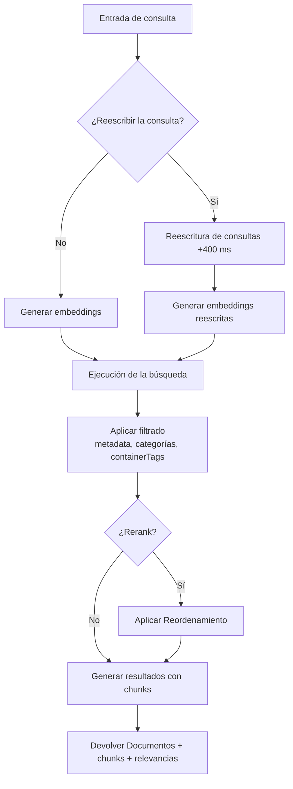
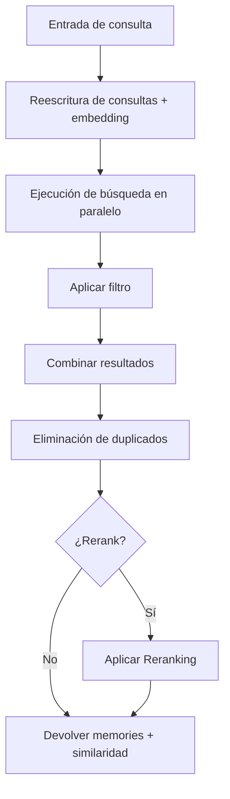

<div id="search-endpoints-overview">
  ## Descripción general de los endpoints de búsqueda
</div>

<CardGroup cols={2}>
  <Card title="Búsqueda de Documentos - RAG rápido y avanzado" icon="settings" href="/es/search/examples/document-search">
    **POST /v3/search**

    Búsqueda completa con amplio control sobre ordenación, filtrado, threshold y estructura de resultados. Busca y devuelve documentos relevantes. Mayor flexibilidad.
  </Card>

  <Card title="Búsqueda de memories" icon="zap" href="/es/search/examples/memory-search">
    **POST /v4/search**

    Búsqueda de latencia mínima optimizada para chatbots e IA conversacional. Busca y devuelve memories. Parámetros simples, respuestas rápidas, fácil de usar.
  </Card>
</CardGroup>

<div id="documents-vs-memories-search-whats-the-difference">
  ## Búsqueda en Documentos vs Memories: ¿Cuál es la diferencia?
</div>

La diferencia clave entre `/v3/search` y `/v4/search` es **documents vs memories**. `/v3/search` busca en los Documentos y devuelve chunks coincidentes, mientras que `/v4/search` busca en las memories, preferencias e historial del usuario.

* **Documentos:** Se refieren a los datos que ingieres, como texto, PDFs, videos, imágenes, etc. Son fuentes de verdad.
* **Memories:** Son extraídas automáticamente de tus Documentos por Supermemory. Chunks de información más pequeños inferidos de Documentos y relacionados entre sí.

Consulta la [guía de ingesta](/es/memory-api/ingesting) para conocer más sobre la diferencia entre Documentos y memories.

<div id="documents-search-v3search">
  ### Búsqueda de documentos (`/v3/search`)
</div>

**Búsqueda de documentos de alta calidad**: parámetros amplios para afinar el comportamiento de la búsqueda:

* **Casos de uso**: Usa este endpoint para casos en los que se requiere una búsqueda de documentos “literal”.
  * Revisar documentos legales/financieros
  * Buscar elementos en Google Drive
  * Chatear con la documentación
* Con este endpoint obtienes **control total** sobre:
  * Umbrales
  * Filtrado
  * Reordenamiento
  * Reescritura de consultas

<Tabs>
  <Tab title="TypeScript">
    ```typescript
    // Documents search
    const results = await client.search.documents({
      q: "machine learning accuracy",
      limit: 10,
      documentThreshold: 0.7,
      chunkThreshold: 0.8,
      rerank: true,
      rewriteQuery: true,
      includeFullDocs: true,
      includeSummary: true,
      onlyMatchingChunks: false,
      containerTags: ["research"],
      filters: {
        AND: [{ key: "category", value: "ai", negate: false }]
      }
    });
    ```
  </Tab>

  <Tab title="Python">
    ```python
    # Documents search
    results = client.search.documents(
        q="machine learning accuracy",
        limit=10,
        document_threshold=0.7,
        chunk_threshold=0.8,
        rerank=True,
        rewrite_query=True,
        include_full_docs=True,
        include_summary=True,
        only_matching_chunks=False,
        container_tags=["research"],
        filters={
            "AND": [{"key": "category", "value": "ai", "negate": False}]
        }
    )
    ```
  </Tab>

  <Tab title="cURL">
    ```bash
    curl -X POST "https://api.supermemory.ai/v3/search" \
      -H "Authorization: Bearer $SUPERMEMORY_API_KEY" \
      -H "Content-Type: application/json" \
      -d '{
        "q": "machine learning accuracy",
        "limit": 10,
        "documentThreshold": 0.7,
        "chunkThreshold": 0.8,
        "rerank": true,
        "rewriteQuery": true,
        "includeFullDocs": true,
        "includeSummary": true,
        "onlyMatchingChunks": false,
        "containerTags": ["research"],
        "filters": {
          "AND": [{"key": "category", "value": "ai", "negate": false}]
        }
      }'
    ```
  </Tab>
</Tabs>

```json Sample Response

{
  "results": [
    {
      "documentId": "doc_abc123",
      "title": "Fundamentos de aprendizaje automático",
      "type": "pdf",
      "score": 0.89,
      "chunks": [
        {
          "content": "El aprendizaje automático es una subárea de la inteligencia artificial...",
          "score": 0.95,
          "isRelevant": true
        }
      ],
      "metadata": {
        "category": "educación",
        "author": "Dr. Smith",
        "difficulty": "principiante"
      },
      "createdAt": "2024-01-15T10:30:00Z",
      "updatedAt": "2024-01-20T14:45:00Z"
    }
  ],
  "timing": 187,
  "total": 1
}
```

El endpoint `/v3/search` devuelve los Documentos más relevantes y los chunks de esos Documentos. Dirígete a la página del [esquema de respuesta](/es/search/response-schema) para obtener más información sobre la estructura de la respuesta.

<div id="memories-search-v4search">
  ### Búsqueda de memories (`/v4/search`)
</div>

**Busca en las memories del usuario**:

* **Casos de uso**: Usa este endpoint cuando comprender el contexto, las preferencias y las memories del usuario sea más importante que una búsqueda literal de documentos.
  * Chatbots personalizados (AI Companions)
  * Selección automática según lo que quiere el usuario
  * Definir el tono de la conversación

Empresas como Composio y [Rube.app](https://rube.app) usan la búsqueda de memories para permitir que el MCP automatice mejor en función de los prompts previos del usuario.

<Info>
  Este endpoint funciona mejor para casos de uso de IA conversacional, como chatbots.
</Info>

<Tabs>
  <Tab title="TypeScript">
    ```typescript
    // Búsqueda de memories
    const results = await client.search.memories({
      q: "machine learning accuracy",
      limit: 5,
      containerTag: "research",
      threshold: 0.7,
      rerank: true
    });
    ```
  </Tab>

  <Tab title="Python">
    ```python
    # Búsqueda de memories
    results = client.search.memories(
        q="machine learning accuracy",
        limit=5,
        container_tag="research",
        threshold=0.7,
        rerank=True
    )
    ```
  </Tab>

  <Tab title="cURL">
    ```bash
    curl -X POST "https://api.supermemory.ai/v4/search" \
      -H "Authorization: Bearer $SUPERMEMORY_API_KEY" \
      -H "Content-Type: application/json" \
      -d '{
        "q": "machine learning accuracy",
        "limit": 5,
        "containerTag": "research",
        "threshold": 0.7,
        "rerank": true
      }'
    ```
  </Tab>
</Tabs>

```json Sample Response
{
  "results": [
    {
      "id": "mem_xyz789",
      "memory": "Contenido completo de la memory sobre aplicaciones de la computación cuántica...",
      "similarity": 0.87,
      "metadata": {
        "category": "research",
        "topic": "quantum-computing"
      },
      "updatedAt": "2024-01-18T09:15:00Z",
      "version": 3,
      "context": {
        "parents": [
          {
            "memory": "Conversación anterior sobre fundamentos de la teoría cuántica...",
            "relation": "extends",
            "version": 2,
            "updatedAt": "2024-01-17T16:30:00Z"
          }
        ],
        "children": [
          {
            "memory": "Preguntas de seguimiento sobre algoritmos cuánticos...",
            "relation": "derives",
            "version": 4,
            "updatedAt": "2024-01-19T11:20:00Z"
          }
        ]
      },
      "documents": [
        {
          "id": "doc_quantum_paper",
          "title": "Aplicaciones de la computación cuántica"
          "type": "pdf",
          "createdAt": "2024-01-10T08:00:00Z"
        }
      ]
    }
  ],
  "timing": 156,
  "total": 1
}

```

El endpoint `/v4/search` busca y devuelve memories.

<div id="search-flow-architecture">
  ## Arquitectura del flujo de búsqueda
</div>

<div id="document-search-v3search-flow">
  ### Flujo de búsqueda de documentos (`/v3/search`)
</div>



<div id="memory-search-v4search-flow">
  ### Flujo de búsqueda de memory (`/v4/search`)
</div>



<div id="key-concepts-you-need-to-understand">
  ## Conceptos clave que debes comprender
</div>

<div id="1-thresholds-sensitivity-control">
  ### 1. Umbrales (control de sensibilidad)
</div>

Los umbrales equilibran calidad y cantidad de resultados:

* **0.0** = Menor sensibilidad (más resultados, menor calidad)
* **1.0** = Mayor sensibilidad (menos resultados, mayor calidad)

```typescript
// Diferentes estrategias de threshold
const broadSearch = await client.search.documents({
  q: "machine learning",
  chunkThreshold: 0.2,      // Devolver más chunks
  documentThreshold: 0.1    // De más Documentos
});

const preciseSearch = await client.search.documents({
  q: "machine learning",
  chunkThreshold: 0.8,      // Solo chunks muy relevantes
  documentThreshold: 0.7    // De Documentos con alta correspondencia
});
```

<div id="2-chunk-context-vs-exact-matching">
  ### 2. Contexto de chunks vs coincidencia exacta
</div>

De forma predeterminada, Supermemory devuelve chunks **con contexto** (texto circundante):

```typescript
// Predeterminado: incluye chunks circundantes para dar contexto
const contextualResults = await client.search.documents({
  q: "neural networks",
  onlyMatchingChunks: false  // Predeterminado
});

// Preciso: solo el texto que coincide exactamente
const exactResults = await client.search.documents({
  q: "neural networks",
  onlyMatchingChunks: true
});
```

<div id="3-query-rewriting-reranking">
  ### 3. Reescritura de consultas y Reordenamiento
</div>

**Query Rewriting** (+400 ms de latencia):

* Expande tu consulta para encontrar resultados más relevantes
* &quot;ML&quot; pasa a ser &quot;machine learning artificial intelligence&quot;
* Útil para abreviaturas y términos específicos del dominio

**Reranking**:

* Recalifica los resultados usando un algoritmo diferente
* Más preciso, pero más lento
* Recomendado para búsquedas críticas

<div id="4-container-tags-vs-metadata-filters">
  ### 4. Etiquetas de contenedor vs filtros de metadata
</div>

Dos mecanismos de filtrado diferentes:

Cuándo usar etiquetas de contenedor:

* El grafo de comprensión del usuario se construye sobre las etiquetas de contenedor. **El grafo se forma sobre las etiquetas de contenedor.**
  * Las etiquetas de contenedor se utilizan para el agrupamiento organizativo y la coincidencia exacta.
  * Son útiles para categorizar contenido y garantizar resultados precisos.
    Cuándo usar filtros de metadata:
  * Cuando necesitas condiciones flexibles más allá de las coincidencias exactas.
  * Útiles para filtrar por atributos como fecha, autor o categoría.

```typescript
// Etiquetas de contenedor: agrupación organizativa (coincidencia exacta de arrays)
const userContent = await client.search.documents({
  q: "python tutorial",
  containerTag: "user_123"  // Debe coincidir exactamente
});

// filters de metadata: consultas de estilo SQL (condiciones flexibles)
const filteredContent = await client.search.documents({
  q: "python tutorial",
  filters: JSON.stringify({
    AND: [
      { key: "language", value: "python", negate: false },
      { key: "difficulty", value: "beginner", negate: false }
    ]
  })
});
```
