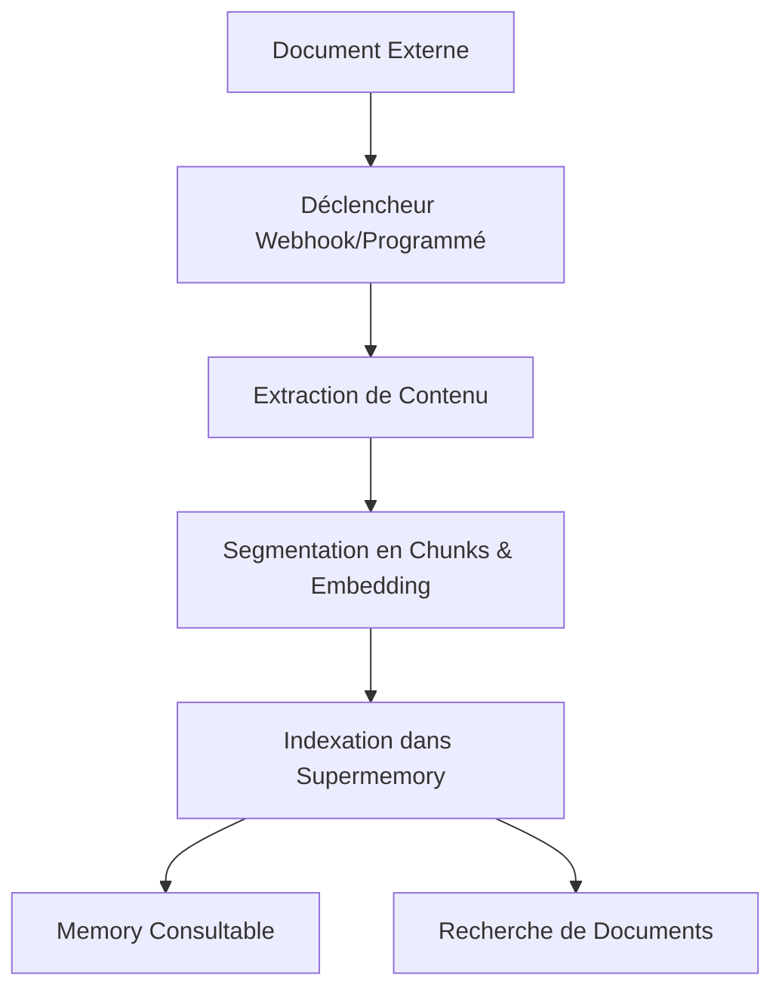

Connectez des plateformes externes pour synchroniser automatiquement des documents avec Supermemory. Les connecteurs disponibles incluent Google Drive, Notion et OneDrive, avec synchronisation en temps réel et traitement intelligent du contenu.

<div id="supported-connectors">
  ## Connecteurs pris en charge
</div>

<CardGroup cols={3}>
  <Card title="Google Drive" icon="google-drive" href="/fr/connectors/google-drive">
    **Google Docs, Slides, Sheets**

    Synchronisation en temps réel via webhooks. Prend en charge les Drive partagés, les dossiers imbriqués et les documents collaboratifs.
  </Card>

  <Card title="Notion" icon="notion" href="/fr/connectors/notion">
    **Pages, bases de données, blocs**

    Synchronisation instantanée du contenu de l’espace de travail. Gère la mise en forme riche, les contenus intégrés et les propriétés de base de données.
  </Card>

  <Card title="OneDrive" icon="microsoft" href="/fr/connectors/onedrive">
    **Word, Excel, PowerPoint**

    Synchronisation planifiée toutes les 4 heures. Prend en charge les comptes personnels et professionnels, avec gestion des versions de fichiers.
  </Card>
</CardGroup>

<div id="quick-start">
  ## Prise en main
</div>

<div id="1-create-connection">
  ### 1. Créer une intégration
</div>

<CodeGroup>
  ```typescript Typescript
  import Supermemory from 'supermemory';

  const client = new Supermemory({
    apiKey: process.env.SUPERMEMORY_API_KEY!
  });

  const connection = await client.connections.create('notion', {
    redirectUrl: 'https://yourapp.com/callback',
    containerTags: ['user-123', 'workspace-alpha'],
    documentLimit: 5000,
    metadata: { department: 'sales' }
  });

  // Redirigez l’utilisateur pour finaliser l’authentification OAuth
  console.log('URL d’authentification :', connection.authLink);
  console.log('Expire dans :', connection.expiresIn);
  // Sortie : URL d’authentification : https://api.notion.com/v1/oauth/authorize?...
  // Sortie : Expire dans : 1 hour
  ```

  ```python Python
  from supermemory import Supermemory
  import os

  client = Supermemory(api_key=os.environ.get("SUPERMEMORY_API_KEY"))

  connection = client.connections.create(
      'notion',
      redirect_url='https://yourapp.com/callback',
      container_tags=['user-123', 'workspace-alpha'],
      document_limit=5000,
      metadata={'department': 'sales'}
  )

  # Redirigez l’utilisateur pour finaliser l’authentification OAuth
  print(f'URL d’authentification : {connection.auth_link}')
  print(f'Expire dans : {connection.expires_in}')
  # Sortie : URL d’authentification : https://api.notion.com/v1/oauth/authorize?...
  # Sortie : Expire dans : 1 hour
  ```

  ```bash cURL
  curl -X POST "https://api.supermemory.ai/v3/connections/notion" \
    -H "Authorization: Bearer $SUPERMEMORY_API_KEY" \
    -H "Content-Type: application/json" \
    -d '{
      "redirectUrl": "https://yourapp.com/callback",
      "containerTags": ["user-123", "workspace-alpha"],
      "documentLimit": 5000,
      "metadata": {"department": "sales"}
    }'

  # Réponse : {
  #   "authLink": "https://api.notion.com/v1/oauth/authorize?...",
  #   "expiresIn": "1 hour",
  #   "id": "conn_abc123",
  #   "redirectsTo": "https://yourapp.com/callback"
  # }
  ```
</CodeGroup>

<div id="2-handle-oauth-callback">
  ### 2. Gérer le callback OAuth
</div>

Une fois l’OAuth terminé par l’utilisateur, l’intégration est automatiquement établie et la synchronisation démarre.

<div id="3-monitor-sync-status">
  ### 3. Surveiller l’état de synchronisation
</div>

<CodeGroup>
  ```typescript Typescript
  import Supermemory from 'supermemory';

  const client = new Supermemory({
    apiKey: process.env.SUPERMEMORY_API_KEY!
  });

  // Lister toutes les intégrations avec le SDK
  const connections = await client.connections.list({
    containerTags: ['user-123', 'workspace-alpha']
  });

  connections.forEach(conn => {
    console.log('Intégration :', conn.id);
    console.log('Provider :', conn.provider);
    console.log('Email :', conn.email);
    console.log('Créée le :', conn.createdAt);
  });

  // Lister les documents synchronisés (memories) avec le SDK
  const memories = await client.memories.list({
    containerTags: ['user-123', 'workspace-alpha']
  });

  console.log(`Synchronisé ${memories.memories.length} documents`);
  // Sortie : Synchronisé 45 documents
  ```

  ```python Python
  from supermemory import Supermemory
  import os

  client = Supermemory(api_key=os.environ.get("SUPERMEMORY_API_KEY"))

  # Lister toutes les intégrations avec le SDK
  connections = client.connections.list(
      container_tags=['user-123', 'workspace-alpha']
  )

  for conn in connections:
      print(f'Intégration : {conn.id}')
      print(f'Provider : {conn.provider}')
      print(f'Email : {conn.email}')
      print(f'Créée le : {conn.created_at}')

  # Lister les documents synchronisés (memories) avec le SDK
  memories = client.memories.list(container_tags=['user-123', 'workspace-alpha'])

  print(f'Synchronisé {len(memories.memories)} documents')
  # Sortie : Synchronisé 45 documents
  ```

  ```bash cURL
  # Lister toutes les intégrations
  curl -X POST "https://api.supermemory.ai/v3/connections/list" \
    -H "Authorization: Bearer $SUPERMEMORY_API_KEY" \
    -H "Content-Type: application/json" \
    -d '{"containerTags": ["user-123", "workspace-alpha"]}'

  # Réponse : [{"id": "conn_abc", "provider": "notion", "email": "user@example.com", ...}]

  # Lister les documents synchronisés
  curl -X POST "https://api.supermemory.ai/v3/documents/list" \
    -H "Authorization: Bearer $SUPERMEMORY_API_KEY" \
    -H "Content-Type: application/json" \
    -d '{"containerTags": ["user-123", "workspace-alpha"]}'

  # Réponse : {"results": [...], "totalCount": 45}
  ```
</CodeGroup>

<div id="how-connectors-work">
  ## Fonctionnement des connecteurs
</div>

<div id="authentication-flow">
  ### Flux d’authentification
</div>

1. **Créer une intégration** : Appelez `/v3/connections/{provider}` pour obtenir l’URL OAuth
2. **Autorisation de l’utilisateur** : Redirigez l’utilisateur pour finaliser le flux OAuth
3. **Configuration automatique** : Intégration établie, la synchronisation démarre immédiatement
4. **Synchronisation continue** : Mises à jour en temps réel via des webhooks + synchronisation planifiée toutes les 4 heures

<div id="document-processing-pipeline">
  ### Chaîne de traitement des documents
</div>



<div id="sync-mechanisms">
  ### Mécanismes de synchronisation
</div>

| Provider | Synchronisation en temps réel | Synchronisation planifiée | Synchronisation manuelle |
|----------|---------------|----------------|-------------|
| **Google Drive** | ✅ Webhooks (expiration au bout de 7 jours) | ✅ Toutes les 4 heures | ✅ À la demande |
| **Notion** | ✅ Webhooks | ✅ Toutes les 4 heures | ✅ À la demande |
| **OneDrive** | ✅ Webhooks (expiration au bout de 30 jours) | ✅ Toutes les 4 heures | ✅ À la demande |

<div id="connection-management">
  ## Gestion des intégrations
</div>

<div id="list-all-connections">
  ### Lister toutes les intégrations
</div>

<CodeGroup>
  ```typescript Typescript
  import Supermemory from 'supermemory';

  const client = new Supermemory({
    apiKey: process.env.SUPERMEMORY_API_KEY!
  });

  const connections = await client.connections.list({
    containerTags: ['org-123']
  });
  ```

  ```python Python
  from supermemory import Supermemory
  import os

  client = Supermemory(api_key=os.environ.get("SUPERMEMORY_API_KEY"))

  connections = client.connections.list(container_tags=['org-123'])

  for conn in connections:
      print(f"{conn.provider}: {conn.email} ({conn.id})")
      print(f"Documents : {conn.document_limit or 'unlimited'}")
      print(f"Expiration : {conn.expires_at or 'never'}")
  # Sortie : notion: user@company.com (conn_abc123)
  # Sortie : Documents : 5000
  # Sortie : Expiration : never
  ```

  ```bash cURL
  curl -X POST "https://api.supermemory.ai/v3/connections/list" \
    -H "Authorization: Bearer $SUPERMEMORY_API_KEY" \
    -H "Content-Type: application/json" \
    -d '{"containerTags": ["org-123"]}'

  # Réponse : [
  #   {
  #     "id": "conn_abc123",
  #     "provider": "notion",
  #     "email": "user@company.com",
  #     "documentLimit": 5000,
  #     "createdAt": "2024-01-15T10:30:00.000Z"
  #   }
  # ]
  ```
</CodeGroup>

<div id="delete-connections">
  ### Supprimer des intégrations
</div>

<CodeGroup>
  ```typescript Typescript
  import Supermemory from 'supermemory';

  const client = new Supermemory({
    apiKey: process.env.SUPERMEMORY_API_KEY!
  });

  // Supprimer par ID d'intégration via le SDK
  const result = await client.connections.delete(connectionId);

  console.log('Supprimé :', result.id, result.provider);
  // Sortie : Supprimé : conn_abc123 notion
  ```

  ```python Python
  from supermemory import Supermemory
  import os

  client = Supermemory(api_key=os.environ.get("SUPERMEMORY_API_KEY"))

  # Supprimer par ID d'intégration via le SDK
  result = client.connections.delete(connection_id)

  print(f"Supprimé : {result.id} {result.provider}")
  # Sortie : Supprimé : conn_abc123 notion
  ```

  ```bash cURL
  curl -X DELETE "https://api.supermemory.ai/v3/connections/conn_abc123" \
    -H "Authorization: Bearer $SUPERMEMORY_API_KEY"

  # Réponse : {
  #   "id": "conn_abc123",
  #   "provider": "notion"
  # }
  ```
</CodeGroup>