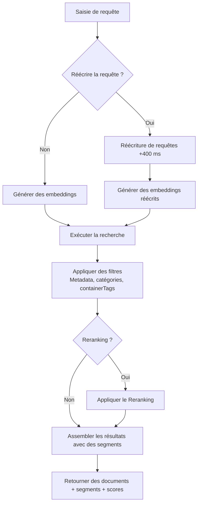
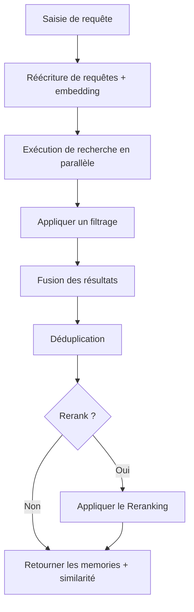

<div id="search-endpoints-overview">
  ## Aperçu des endpoints de recherche
</div>

<CardGroup cols={2}>
  <Card title="Recherche de documents — RAG rapide et avancé" icon="settings" href="/fr/search/examples/document-search">
    **POST /v3/search**

    Recherche complète avec un contrôle étendu du classement, du filtrage, des threshold et de la structure des résultats. Parcourt et renvoie les documents pertinents. Plus de flexibilité.
  </Card>

  <Card title="Recherche de memories" icon="zap" href="/fr/search/examples/memory-search">
    **POST /v4/search**

    Recherche à latence minimale, optimisée pour les chatbots et l’IA conversationnelle. Parcourt et renvoie des memories. Paramètres simples, réponses rapides, facile à utiliser.
  </Card>
</CardGroup>

<div id="documents-vs-memories-search-whats-the-difference">
  ## Recherche dans les documents vs les memories : quelle est la différence ?
</div>

La principale différence entre `/v3/search` et `/v4/search` concerne **documents vs memories**. `/v3/search` interroge les documents et renvoie des segments correspondants, tandis que `/v4/search` interroge les memories, les préférences et l’historique de l’utilisateur.

* **Documents :** Les données que vous ingérez (texte, PDF, vidéos, images, etc.). Elles constituent des sources de vérité.
* **Memories :** Elles sont automatiquement extraites de vos documents par Supermemory. De plus petits segments d’information inférés à partir des documents et liés entre eux.

Consultez le [guide d’ingestion](/fr/memory-api/ingesting) pour en savoir plus sur la différence entre les documents et les memories.

<div id="documents-search-v3search">
  ### Recherche de documents (`/v3/search`)
</div>

**Recherche de documents de haute qualité** — paramètres étendus pour affiner le comportement de la recherche :

* **Cas d’usage** : utilisez cet endpoint pour les cas où une recherche de documents « littérale » est requise.
  * Parcourir des documents juridiques/financiers
  * Rechercher des éléments dans Google Drive
  * Discuter avec la documentation
* Avec cet endpoint, vous bénéficiez d’un **contrôle total** sur :
  * Seuils,
  * Filtrage
  * Reranking
  * Réécriture de requêtes

<Tabs>
  <Tab title="TypeScript">
    ```typescript
    // Documents search
    const results = await client.search.documents({
      q: "machine learning accuracy",
      limit: 10,
      documentThreshold: 0.7,
      chunkThreshold: 0.8,
      rerank: true,
      rewriteQuery: true,
      includeFullDocs: true,
      includeSummary: true,
      onlyMatchingChunks: false,
      containerTags: ["research"],
      filters: {
        AND: [{ key: "category", value: "ai", negate: false }]
      }
    });
    ```
  </Tab>

  <Tab title="Python">
    ```python
    # Documents search
    results = client.search.documents(
        q="machine learning accuracy",
        limit=10,
        document_threshold=0.7,
        chunk_threshold=0.8,
        rerank=True,
        rewrite_query=True,
        include_full_docs=True,
        include_summary=True,
        only_matching_chunks=False,
        container_tags=["research"],
        filters={
            "AND": [{"key": "category", "value": "ai", "negate": False}]
        }
    )
    ```
  </Tab>

  <Tab title="cURL">
    ```bash
    curl -X POST "https://api.supermemory.ai/v3/search" \
      -H "Authorization: Bearer $SUPERMEMORY_API_KEY" \
      -H "Content-Type: application/json" \
      -d '{
        "q": "machine learning accuracy",
        "limit": 10,
        "documentThreshold": 0.7,
        "chunkThreshold": 0.8,
        "rerank": true,
        "rewriteQuery": true,
        "includeFullDocs": true,
        "includeSummary": true,
        "onlyMatchingChunks": false,
        "containerTags": ["research"],
        "filters": {
          "AND": [{"key": "category", "value": "ai", "negate": false}]
        }
      }'
    ```
  </Tab>
</Tabs>

```json Sample Response

{
  "results": [
    {
      "documentId": "doc_abc123",
      "title": "Principes de l’apprentissage automatique",
      "type": "pdf",
      "score": 0.89,
      "chunks": [
        {
          "content": "L’apprentissage automatique est un sous-ensemble de l’intelligence artificielle...",
          "score": 0.95,
          "isRelevant": true
        }
      ],
      "metadata": {
        "category": "education",
        "author": "Dr. Smith",
        "difficulty": "débutant"
      },
      "createdAt": "2024-01-15T10:30:00Z",
      "updatedAt": "2024-01-20T14:45:00Z"
    }
  ],
  "timing": 187,
  "total": 1
}
```

L’endpoint `/v3/search` renvoie les documents les plus pertinents ainsi que les segments correspondants. Consultez la page [schéma de réponse](/fr/search/response-schema) pour en savoir plus sur la structure de la réponse.

<div id="memories-search-v4search">
  ### Recherche de memories (`/v4/search`)
</div>

**Rechercher dans les memories des utilisateurs** :

* **Cas d’usage** : utilisez cet endpoint pour des situations où la compréhension du contexte, des préférences et des memories de l’utilisateur est plus importante qu’une recherche littérale de documents.
  * Chatbots personnalisés (AI Companions)
  * Sélection automatique en fonction de l’intention de l’utilisateur
  * Définir le ton de la conversation

Des entreprises comme Composio et [Rube.app](https://rube.app) utilisent la recherche de memories pour permettre au MCP d’automatiser plus efficacement en se basant sur les prompts précédents de l’utilisateur.

<Info>
  Cet endpoint est particulièrement adapté aux cas d’usage d’IA conversationnelle comme les chatbots.
</Info>

<Tabs>
  <Tab title="TypeScript">
    ```typescript
    // Recherche de memories
    const results = await client.search.memories({
      q: "machine learning accuracy",
      limit: 5,
      containerTag: "research",
      threshold: 0.7,
      rerank: true
    });
    ```
  </Tab>

  <Tab title="Python">
    ```python
    # Recherche de memories
    results = client.search.memories(
        q="machine learning accuracy",
        limit=5,
        container_tag="research",
        threshold=0.7,
        rerank=True
    )
    ```
  </Tab>

  <Tab title="cURL">
    ```bash
    curl -X POST "https://api.supermemory.ai/v4/search" \
      -H "Authorization: Bearer $SUPERMEMORY_API_KEY" \
      -H "Content-Type: application/json" \
      -d '{
        "q": "machine learning accuracy",
        "limit": 5,
        "containerTag": "research",
        "threshold": 0.7,
        "rerank": true
      }'
    ```
  </Tab>
</Tabs>

```json Sample Response
{
  "results": [
    {
      "id": "mem_xyz789",
      "memory": "Contenu complet de la memory sur les applications de l’informatique quantique...",
      "similarity": 0.87,
      "metadata": {
        "category": "research",
        "topic": "quantum-computing"
      },
      "updatedAt": "2024-01-18T09:15:00Z",
      "version": 3,
      "context": {
        "parents": [
          {
            "memory": "Discussion précédente sur les bases de la théorie quantique...",
            "relation": "prolonge",
            "version": 2,
            "updatedAt": "2024-01-17T16:30:00Z"
          }
        ],
        "children": [
          {
            "memory": "Questions de suivi sur les algorithmes quantiques...",
            "relation": "dérive de",
            "version": 4,
            "updatedAt": "2024-01-19T11:20:00Z"
          }
        ]
      },
      "documents": [
        {
          "id": "doc_quantum_paper",
          "title": "Applications de l’informatique quantique"
          "type": "pdf",
          "createdAt": "2024-01-10T08:00:00Z"
        }
      ]
    }
  ],
  "timing": 156,
  "total": 1
}

```

Le point de terminaison `/v4/search` effectue une recherche et renvoie des memories.

<div id="search-flow-architecture">
  ## Architecture du flux de recherche
</div>

<div id="document-search-v3search-flow">
  ### Processus de recherche de documents (`/v3/search`)
</div>



<div id="memory-search-v4search-flow">
  ### Flux de recherche de memory (`/v4/search`)
</div>



<div id="key-concepts-you-need-to-understand">
  ## Concepts clés à connaître
</div>

<div id="1-thresholds-sensitivity-control">
  ### 1. Seuils (contrôle de la sensibilité)
</div>

Les seuils règlent l’équilibre entre la qualité et la quantité des résultats :

* **0.0** = Sensibilité minimale (plus de résultats, qualité moindre)
* **1.0** = Sensibilité maximale (moins de résultats, meilleure qualité)

```typescript
// Différentes stratégies de threshold
const broadSearch = await client.search.documents({
  q: "machine learning",
  chunkThreshold: 0.2,      // Renvoyer plus de segments
  documentThreshold: 0.1    // À partir d’un plus grand nombre de documents
});

const preciseSearch = await client.search.documents({
  q: "machine learning",
  chunkThreshold: 0.8,      // Uniquement des segments très pertinents
  documentThreshold: 0.7    // À partir de documents très proches de la requête
});
```

<div id="2-chunk-context-vs-exact-matching">
  ### 2. Contexte de segment vs correspondance exacte
</div>

Par défaut, Supermemory renvoie des segments **avec contexte** (texte environnant) :

```typescript
// Par défaut : inclut les segments environnants pour le contexte
const contextualResults = await client.search.documents({
  q: "neural networks",
  onlyMatchingChunks: false  // Par défaut
});

// Précis : uniquement le texte correspondant exactement
const exactResults = await client.search.documents({
  q: "neural networks",
  onlyMatchingChunks: true
});
```

<div id="3-query-rewriting-reranking">
  ### 3. Réécriture de requêtes et Reranking
</div>

**Réécriture de requêtes** (+400 ms de latence) :

* Élargit votre requête pour trouver des résultats plus pertinents
* &quot;ML&quot; devient &quot;machine learning intelligence artificielle&quot;
* Utile pour les abréviations et les termes propres à un domaine

**Reranking** :

* Réévalue le score des résultats à l&#39;aide d&#39;un algorithme différent
* Plus précis mais plus lent
* Recommandé pour les recherches critiques

<div id="4-container-tags-vs-metadata-filters">
  ### 4. Balises de conteneur vs filtres de Metadata
</div>

Deux mécanismes de filtrage distincts :

Quand utiliser les balises de conteneur :

* Le graphe de compréhension utilisateur est construit sur les balises de conteneur. **Le graphe est établi sur les balises de conteneur.**
  * Les balises de conteneur servent au regroupement organisationnel et aux correspondances exactes.
  * Elles sont utiles pour catégoriser le contenu et garantir des résultats précis.
    Quand utiliser les filtres de Metadata :
  * Lorsque vous avez besoin de conditions flexibles au-delà des correspondances exactes.
  * Utile pour filtrer par des attributs comme la date, l’auteur ou la catégorie.

```typescript
// Tags de conteneur : regroupement organisationnel (correspondance exacte du tableau)
const userContent = await client.search.documents({
  q: "python tutorial",
  containerTag: "user_123"  // Doit correspondre exactement
});

// Filtres de Metadata : requêtes de type SQL (conditions flexibles)
const filteredContent = await client.search.documents({
  q: "python tutorial",
  filters: JSON.stringify({
    AND: [
      { key: "language", value: "python", negate: false },
      { key: "difficulty", value: "beginner", negate: false }
    ]
  })
});
```
