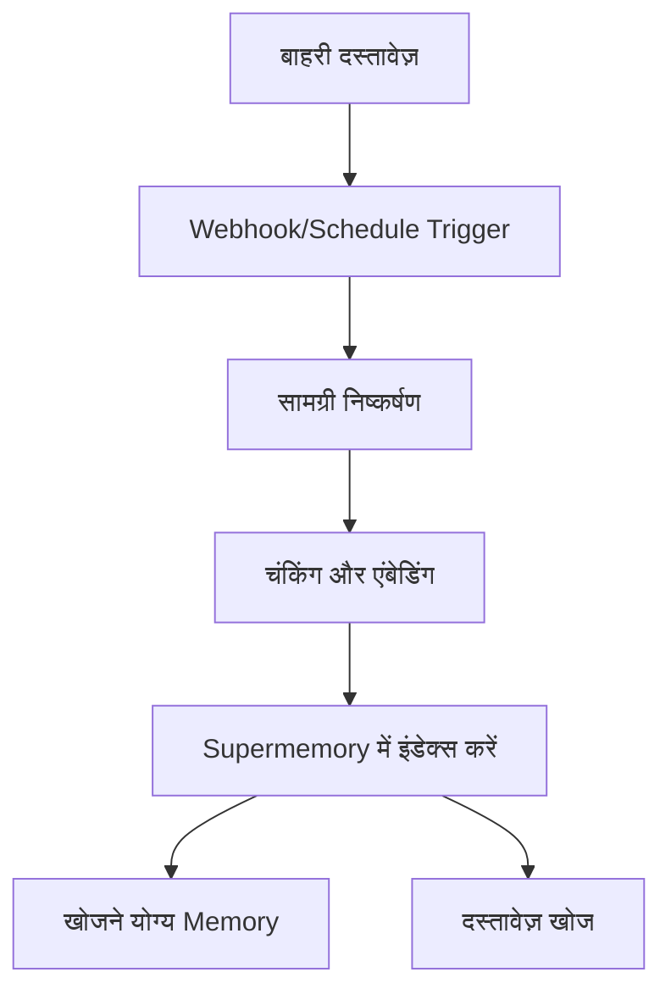

बाहरी प्लेटफ़ॉर्म्स को कनेक्ट करें ताकि Documents स्वतः Supermemory में सिंक हो सकें। समर्थित कनेक्टर्स में Google Drive, Notion और OneDrive शामिल हैं, जो रियल‑टाइम सिंक्रोनाइज़ेशन और इंटेलिजेंट कंटेंट प्रोसेसिंग प्रदान करते हैं।

<div id="supported-connectors">
  ## समर्थित कनेक्टर्स
</div>

<CardGroup cols={3}>
  <Card title="Google Drive" icon="google-drive" href="/hi/connectors/google-drive">
    **Google Docs, Slides, Sheets**

    वेबहुक्स के जरिए रीयल‑टाइम सिंक। साझा ड्राइव, नेस्टेड फ़ोल्डर और सहयोगात्मक Documents का समर्थन।
  </Card>

  <Card title="Notion" icon="notion" href="/hi/connectors/notion">
    **Pages, Databases, Blocks**

    वर्कस्पेस सामग्री का त्वरित सिंक। रिच फ़ॉर्मेटिंग, एम्बेड्स और डेटाबेस प्रॉपर्टीज़ को हैंडल करता है।
  </Card>

  <Card title="OneDrive" icon="microsoft" href="/hi/connectors/onedrive">
    **Word, Excel, PowerPoint**

    हर 4 घंटे पर शेड्यूल्ड सिंक। फ़ाइल वर्ज़निंग के साथ व्यक्तिगत और बिज़नेस खातों का समर्थन।
  </Card>
</CardGroup>

<div id="quick-start">
  ## त्वरित आरंभ
</div>

<div id="1-create-connection">
  ### 1. लिंक्ड खाता बनाएं
</div>

<CodeGroup>
  ```typescript Typescript
  import Supermemory from 'supermemory';

  const client = new Supermemory({
    apiKey: process.env.SUPERMEMORY_API_KEY!
  });

  const connection = await client.connections.create('notion', {
    redirectUrl: 'https://yourapp.com/callback',
    containerTags: ['user-123', 'workspace-alpha'],
    documentLimit: 5000,
    metadata: { department: 'sales' }
  });

  // उपयोगकर्ता को OAuth पूरा करने के लिए रीडायरेक्ट करें
  console.log('Auth URL:', connection.authLink);
  console.log('Expires in:', connection.expiresIn);
  // आउटपुट: Auth URL: https://api.notion.com/v1/oauth/authorize?...
  // आउटपुट: Expires in: 1 hour
  ```

  ```python Python
  from supermemory import Supermemory
  import os

  client = Supermemory(api_key=os.environ.get("SUPERMEMORY_API_KEY"))

  connection = client.connections.create(
      'notion',
      redirect_url='https://yourapp.com/callback',
      container_tags=['user-123', 'workspace-alpha'],
      document_limit=5000,
      metadata={'department': 'sales'}
  )

  # उपयोगकर्ता को OAuth पूरा करने के लिए रीडायरेक्ट करें
  print(f'Auth URL: {connection.auth_link}')
  print(f'Expires in: {connection.expires_in}')
  # आउटपुट: Auth URL: https://api.notion.com/v1/oauth/authorize?...
  # आउटपुट: Expires in: 1 hour
  ```

  ```bash cURL
  curl -X POST "https://api.supermemory.ai/v3/connections/notion" \
    -H "Authorization: Bearer $SUPERMEMORY_API_KEY" \
    -H "Content-Type: application/json" \
    -d '{
      "redirectUrl": "https://yourapp.com/callback",
      "containerTags": ["user-123", "workspace-alpha"],
      "documentLimit": 5000,
      "metadata": {"department": "sales"}
    }'

  # प्रतिक्रिया: {
  #   "authLink": "https://api.notion.com/v1/oauth/authorize?...",
  #   "expiresIn": "1 hour",
  #   "id": "conn_abc123",
  #   "redirectsTo": "https://yourapp.com/callback"
  # }
  ```
</CodeGroup>

<div id="2-handle-oauth-callback">
  ### 2. OAuth कॉलबैक हैंडल करें
</div>

उपयोगकर्ता के OAuth पूरा करने के बाद, लिंक्ड खाता अपने आप बन जाता है और सिंक शुरू हो जाता है।

<div id="3-monitor-sync-status">
  ### 3. Sync स्थिति मॉनिटर करें
</div>

<CodeGroup>
  ```typescript Typescript
  import Supermemory from 'supermemory';

  const client = new Supermemory({
    apiKey: process.env.SUPERMEMORY_API_KEY!
  });

  // SDK का उपयोग करके सभी लिंक्ड खाते सूचीबद्ध करें
  const connections = await client.connections.list({
    containerTags: ['user-123', 'workspace-alpha']
  });

  connections.forEach(conn => {
    console.log('Connection:', conn.id);
    console.log('Provider:', conn.provider);
    console.log('Email:', conn.email);
    console.log('Created:', conn.createdAt);
  });

  // SDK का उपयोग करके synced Documents (memories) सूचीबद्ध करें
  const memories = await client.memories.list({
    containerTags: ['user-123', 'workspace-alpha']
  });

  console.log(`Synced ${memories.memories.length} documents`);
  // आउटपुट: Synced 45 documents
  ```

  ```python Python
  from supermemory import Supermemory
  import os

  client = Supermemory(api_key=os.environ.get("SUPERMEMORY_API_KEY"))

  # SDK का उपयोग करके सभी लिंक्ड खाते सूचीबद्ध करें
  connections = client.connections.list(
      container_tags=['user-123', 'workspace-alpha']
  )

  for conn in connections:
      print(f'Connection: {conn.id}')
      print(f'Provider: {conn.provider}')
      print(f'Email: {conn.email}')
      print(f'Created: {conn.created_at}')

  # SDK का उपयोग करके synced Documents (memories) सूचीबद्ध करें
  memories = client.memories.list(container_tags=['user-123', 'workspace-alpha'])

  print(f'Synced {len(memories.memories)} documents')
  # आउटपुट: Synced 45 documents
  ```

  ```bash cURL
  # सभी लिंक्ड खाते सूचीबद्ध करें
  curl -X POST "https://api.supermemory.ai/v3/connections/list" \
    -H "Authorization: Bearer $SUPERMEMORY_API_KEY" \
    -H "Content-Type: application/json" \
    -d '{"containerTags": ["user-123", "workspace-alpha"]}'

  # प्रतिक्रिया: [{"id": "conn_abc", "provider": "notion", "email": "user@example.com", ...}]

  # synced Documents सूचीबद्ध करें
  curl -X POST "https://api.supermemory.ai/v3/documents/list" \
    -H "Authorization: Bearer $SUPERMEMORY_API_KEY" \
    -H "Content-Type: application/json" \
    -d '{"containerTags": ["user-123", "workspace-alpha"]}'

  # प्रतिक्रिया: {"results": [...], "totalCount": 45}
  ```
</CodeGroup>

<div id="how-connectors-work">
  ## कनेक्टर्स कैसे काम करते हैं
</div>

<div id="authentication-flow">
  ### Authentication Flow
</div>

1. **कनेक्शन बनाएँ**: OAuth url प्राप्त करने के लिए `/v3/connections/{provider}` कॉल करें
2. **उपयोगकर्ता अधिकृति**: OAuth फ्लो पूरा कराने के लिए उपयोगकर्ता को रीडायरेक्ट करें
3. **स्वचालित सेटअप**: लिंक्ड खाता बनते ही सिंक तुरंत शुरू हो जाता है
4. **निरंतर सिंक**: वेबहुक्स के जरिए रियल‑टाइम अपडेट + हर 4 घंटे पर निर्धारित सिंक

<div id="document-processing-pipeline">
  ### डॉक्यूमेंट प्रोसेसिंग पाइपलाइन
</div>



<div id="sync-mechanisms">
  ### सिंक मेकैनिज़्म
</div>

| provider | रियल-टाइम सिंक | शेड्यूल्ड सिंक | मैनुअल सिंक |
|----------|-----------------|----------------|--------------|
| **Google Drive** | ✅ वेबहुक (7-दिन की अवधि) | ✅ हर 4 घंटे | ✅ ऑन-डिमांड |
| **Notion** | ✅ वेबहुक | ✅ हर 4 घंटे | ✅ ऑन-डिमांड |
| **OneDrive** | ✅ वेबहुक (30-दिन की अवधि) | ✅ हर 4 घंटे | ✅ ऑन-डिमांड |

<div id="connection-management">
  ## लिंक्ड खाता प्रबंधन
</div>

<div id="list-all-connections">
  ### सभी लिंक्ड खाते सूचीबद्ध करें
</div>

<CodeGroup>
  ```typescript Typescript
  import Supermemory from 'supermemory';

  const client = new Supermemory({
    apiKey: process.env.SUPERMEMORY_API_KEY!
  });

  const connections = await client.connections.list({
    containerTags: ['org-123']
  });
  ```

  ```python Python
  from supermemory import Supermemory
  import os

  client = Supermemory(api_key=os.environ.get("SUPERMEMORY_API_KEY"))

  connections = client.connections.list(container_tags=['org-123'])

  for conn in connections:
      print(f"{conn.provider}: {conn.email} ({conn.id})")
      print(f"Documents: {conn.document_limit or 'unlimited'}")
      print(f"Expires: {conn.expires_at or 'never'}")
  # आउटपुट: notion: user@company.com (conn_abc123)
  # आउटपुट: Documents: 5000
  # आउटपुट: Expires: never
  ```

  ```bash cURL
  curl -X POST "https://api.supermemory.ai/v3/connections/list" \
    -H "Authorization: Bearer $SUPERMEMORY_API_KEY" \
    -H "Content-Type: application/json" \
    -d '{"containerTags": ["org-123"]}'

  # प्रतिक्रिया: [
  #   {
  #     "id": "conn_abc123",
  #     "provider": "notion",
  #     "email": "user@company.com",
  #     "documentLimit": 5000,
  #     "createdAt": "2024-01-15T10:30:00.000Z"
  #   }
  # ]
  ```
</CodeGroup>

<div id="delete-connections">
  ### लिंक्ड खातों को हटाएँ
</div>

<CodeGroup>
  ```typescript Typescript
  import Supermemory from 'supermemory';

  const client = new Supermemory({
    apiKey: process.env.SUPERMEMORY_API_KEY!
  });

  // SDK का उपयोग करके connection ID से हटाएँ
  const result = await client.connections.delete(connectionId);

  console.log('Deleted:', result.id, result.provider);
  // आउटपुट: Deleted: conn_abc123 notion
  ```

  ```python Python
  from supermemory import Supermemory
  import os

  client = Supermemory(api_key=os.environ.get("SUPERMEMORY_API_KEY"))

  # SDK का उपयोग करके connection ID से हटाएँ
  result = client.connections.delete(connection_id)

  print(f"Deleted: {result.id} {result.provider}")
  # आउटपुट: Deleted: conn_abc123 notion
  ```

  ```bash cURL
  curl -X DELETE "https://api.supermemory.ai/v3/connections/conn_abc123" \
    -H "Authorization: Bearer $SUPERMEMORY_API_KEY"

  # प्रतिक्रिया: {
  #   "id": "conn_abc123",
  #   "provider": "notion"
  # }
  ```
</CodeGroup>