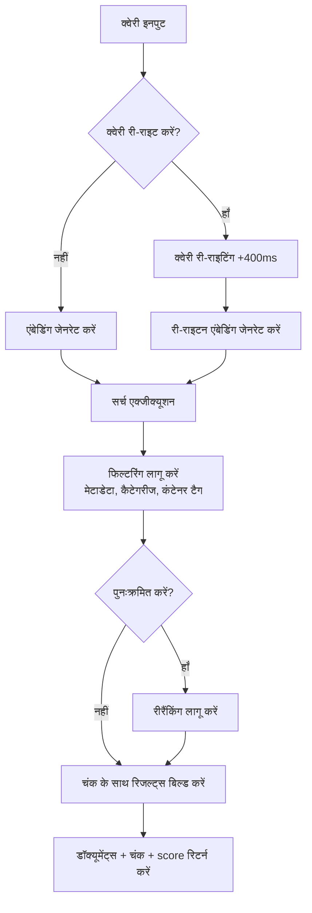
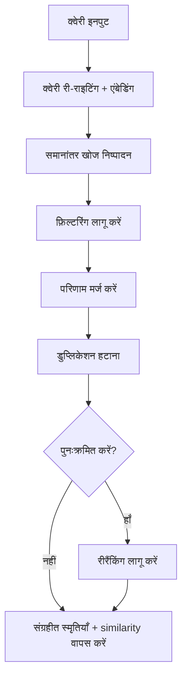

<div id="search-endpoints-overview">
  ## Search Endpoints का अवलोकन
</div>

<CardGroup cols={2}>
  <Card title="Documents Search - तेज़, उन्नत RAG" icon="settings" href="/hi/search/examples/document-search">
    **POST /v3/search**

    रैंकिंग, फ़िल्टरिंग, थ्रेशोल्ड, और परिणाम संरचना पर व्यापक नियंत्रण के साथ फुल-फ़ीचर्ड सर्च। संबंधित डॉक्यूमेंट्स में खोज करता है और उन्हें लौटाता है। अधिक लचीलापन।
  </Card>

  <Card title="Memories Search" icon="zap" href="/hi/search/examples/memory-search">
    **POST /v4/search**

    चैटबॉट्स और संवादात्मक AI के लिए अनुकूलित न्यूनतम लेटेंसी सर्च। memory में खोज करता है और उन्हें लौटाता है। सरल पैरामीटर, तेज़ प्रतिक्रियाएँ, उपयोग में आसान।
  </Card>
</CardGroup>

<div id="documents-vs-memories-search-whats-the-difference">
  ## डॉक्यूमेंट्स बनाम संग्रहीत स्मृतियाँ सर्च: क्या अंतर है?
</div>

`/v3/search` और `/v4/search` के बीच मुख्य अंतर **documents vs memories** है। `/v3/search` डॉक्यूमेंट्स में खोज करता है और मेल खाते चंक लौटाता है, जबकि `/v4/search` उपयोगकर्ता की memory, प्राथमिकताएँ और इतिहास में खोज करता है।

* **Documents:** वह डेटा जिसे आप इनजेस्ट करते हैं—जैसे टेक्स्ट, PDFs, वीडियो, इमेजेज आदि। ये ग्राउंड ट्रुथ के स्रोत होते हैं।
* **Memories:** ये Supermemory द्वारा आपके डॉक्यूमेंट्स से स्वचालित रूप से निकाली जाती हैं—डॉक्यूमेंट्स से निष्कर्षित, एक-दूसरे से संबंधित छोटी जानकारी के चंक।

डॉक्यूमेंट्स और संग्रहीत स्मृतियों के बीच अंतर के बारे में अधिक जानने के लिए [ingestion guide](/hi/memory-api/ingesting) देखें।

<div id="documents-search-v3search">
  ### डॉक्यूमेंट्स सर्च (`/v3/search`)
</div>

**उच्च-गुणवत्ता डॉक्यूमेंट सर्च** — सर्च व्यवहार को फाइन-ट्यून करने के लिए व्यापक पैरामीटर:

* **उपयोग के मामले**: इस endpoint का उपयोग उन परिदृश्यों में करें जहाँ &quot;लिटरल&quot; डॉक्यूमेंट सर्च आवश्यक हो।
  * लीगल/फाइनेंस डॉक्यूमेंट्स देखना
  * Google Drive में आइटम्स खोज करना
  * डॉक्यूमेंटेशन के साथ चैट
* इस endpoint के साथ, आपको **पूर्ण नियंत्रण** मिलता है:
  * थ्रेशोल्ड्स
  * फिल्टरिंग
  * रीरैंकिंग
  * क्वेरी री-राइटिंग

<Tabs>
  <Tab title="TypeScript">
    ```typescript
    // Documents search
    const results = await client.search.documents({
      q: "machine learning accuracy",
      limit: 10,
      documentThreshold: 0.7,
      chunkThreshold: 0.8,
      rerank: true,
      rewriteQuery: true,
      includeFullDocs: true,
      includeSummary: true,
      onlyMatchingChunks: false,
      containerTags: ["research"],
      filters: {
        AND: [{ key: "category", value: "ai", negate: false }]
      }
    });
    ```
  </Tab>

  <Tab title="Python">
    ```python
    # Documents search
    results = client.search.documents(
        q="machine learning accuracy",
        limit=10,
        document_threshold=0.7,
        chunk_threshold=0.8,
        rerank=True,
        rewrite_query=True,
        include_full_docs=True,
        include_summary=True,
        only_matching_chunks=False,
        container_tags=["research"],
        filters={
            "AND": [{"key": "category", "value": "ai", "negate": False}]
        }
    )
    ```
  </Tab>

  <Tab title="cURL">
    ```bash
    curl -X POST "https://api.supermemory.ai/v3/search" \
      -H "Authorization: Bearer $SUPERMEMORY_API_KEY" \
      -H "Content-Type: application/json" \
      -d '{
        "q": "machine learning accuracy",
        "limit": 10,
        "documentThreshold": 0.7,
        "chunkThreshold": 0.8,
        "rerank": true,
        "rewriteQuery": true,
        "includeFullDocs": true,
        "includeSummary": true,
        "onlyMatchingChunks": false,
        "containerTags": ["research"],
        "filters": {
          "AND": [{"key": "category", "value": "ai", "negate": false}]
        }
      }'
    ```
  </Tab>
</Tabs>

```json Sample Response

{
  "results": [
    {
      "documentId": "doc_abc123",
      "title": "मशीन लर्निंग की मूल बातें",
      "type": "pdf",
      "score": 0.89,
      "chunks": [
        {
          "content": "मशीन लर्निंग कृत्रिम बुद्धिमत्ता का एक हिस्सा है...",
          "score": 0.95,
          "isRelevant": true
        }
      ],
      "metadata": {
        "category": "शिक्षा",
        "author": "डॉ. स्मिथ",
        "difficulty": "प्रारंभिक"
      },
      "createdAt": "2024-01-15T10:30:00Z",
      "updatedAt": "2024-01-20T14:45:00Z"
    }
  ],
  "timing": 187,
  "total": 1
}
```

`/v3/search` एंडपॉइंट सबसे प्रासंगिक डॉक्यूमेंट्स और उनसे संबंधित चंक लौटाता है। प्रतिक्रिया की संरचना के बारे में अधिक जानने के लिए [response schema](/hi/search/response-schema) पेज पर जाएँ।

<div id="memories-search-v4search">
  ### संग्रहीत स्मृतियों की खोज (`/v4/search`)
</div>

**उपयोगकर्ता की संग्रहीत स्मृतियों में खोज करें**:

* **उपयोग के मामले**: इस endpoint का उपयोग उन स्थितियों में करें जहाँ उपयोगकर्ता का संदर्भ/पसंद/संग्रहीत स्मृतियाँ समझना, शाब्दिक दस्तावेज़ खोज से अधिक महत्वपूर्ण हो।
  * पर्सनलाइज़्ड चैटबॉट्स (AI Companions)
  * उपयोगकर्ता की इच्छा के आधार पर स्वतः चयन
  * बातचीत का टोन तय करना

Composio जैसी कंपनियाँ [Rube.app](https://rube.app) पूर्व के उपयोगकर्ता प्रॉम्प्ट्स के आधार पर MCP को बेहतर तरीके से स्वचालित कराने के लिए memories search का उपयोग करती हैं।

<Info>
  यह endpoint चैटबॉट्स जैसे conversational AI उपयोग के मामलों के लिए सबसे उपयुक्त है।
</Info>

<Tabs>
  <Tab title="TypeScript">
    ```typescript
    // Memories search
    const results = await client.search.memories({
      q: "machine learning accuracy",
      limit: 5,
      containerTag: "research",
      threshold: 0.7,
      rerank: true
    });
    ```
  </Tab>

  <Tab title="Python">
    ```python
    # Memories search
    results = client.search.memories(
        q="machine learning accuracy",
        limit=5,
        container_tag="research",
        threshold=0.7,
        rerank=True
    )
    ```
  </Tab>

  <Tab title="cURL">
    ```bash
    curl -X POST "https://api.supermemory.ai/v4/search" \
      -H "Authorization: Bearer $SUPERMEMORY_API_KEY" \
      -H "Content-Type: application/json" \
      -d '{
        "q": "machine learning accuracy",
        "limit": 5,
        "containerTag": "research",
        "threshold": 0.7,
        "rerank": true
      }'
    ```
  </Tab>
</Tabs>

```json Sample Response
{
  "results": [
    {
      "id": "mem_xyz789",
      "memory": "क्वांटम कंप्यूटिंग अनुप्रयोगों के बारे में संपूर्ण memory सामग्री...",
      "similarity": 0.87,
      "metadata": {
        "category": "research",
        "topic": "quantum-computing"
      },
      "updatedAt": "2024-01-18T09:15:00Z",
      "version": 3,
      "context": {
        "parents": [
          {
            "memory": "क्वांटम सिद्धांत की मूल बातों पर पूर्व चर्चा...",
            "relation": "extends",
            "version": 2,
            "updatedAt": "2024-01-17T16:30:00Z"
          }
        ],
        "children": [
          {
            "memory": "क्वांटम एल्गोरिदम के बारे में अनुवर्ती प्रश्न...",
            "relation": "derives",
            "version": 4,
            "updatedAt": "2024-01-19T11:20:00Z"
          }
        ]
      },
      "documents": [
        {
          "id": "doc_quantum_paper",
          "title": "क्वांटम कंप्यूटिंग अनुप्रयोग",
          "type": "pdf",
          "createdAt": "2024-01-10T08:00:00Z"
        }
      ]
    }
  ],
  "timing": 156,
  "total": 1
}

```

`/v4/search` endpoint संग्रहीत स्मृतियों में खोज करता है और उन्हें लौटाता है।

<div id="search-flow-architecture">
  ## सर्च फ्लो आर्किटेक्चर
</div>

<div id="document-search-v3search-flow">
  ### डॉक्युमेंट सर्च (`/v3/search`) फ्लो
</div>



<div id="memory-search-v4search-flow">
  ### memory खोज (`/v4/search`) फ़्लो
</div>



<div id="key-concepts-you-need-to-understand">
  ## वे मुख्य सिद्धांत जिन्हें आपको समझना चाहिए
</div>

<div id="1-thresholds-sensitivity-control">
  ### 1. थ्रेशोल्ड्स (संवेदनशीलता नियंत्रण)
</div>

थ्रेशोल्ड्स परिणामों की गुणवत्ता और मात्रा के संतुलन को नियंत्रित करते हैं:

* **0.0** = न्यूनतम संवेदनशील (अधिक परिणाम, कम गुणवत्ता)
* **1.0** = अधिकतम संवेदनशील (कम परिणाम, उच्च गुणवत्ता)

```typescript
// विभिन्न थ्रेशोल्ड रणनीतियां
const broadSearch = await client.search.documents({
  q: "machine learning",
  chunkThreshold: 0.2,      // अधिक चंक रिटर्न करें
  documentThreshold: 0.1    // अधिक डॉक्यूमेंट्स से
});

const preciseSearch = await client.search.documents({
  q: "machine learning",
  chunkThreshold: 0.8,      // केवल अत्यधिक प्रासंगिक चंक
  documentThreshold: 0.7    // निकटता से मैच करने वाले डॉक्यूमेंट्स से
});
```

<div id="2-chunk-context-vs-exact-matching">
  ### 2. चंक संदर्भ बनाम सटीक मिलान
</div>

डिफ़ॉल्ट रूप से, Supermemory संदर्भ **समेत** चंक लौटाता है (आस-पास का पाठ):

```typescript
// डिफ़ॉल्ट: संदर्भ के लिए आसपास के chunks शामिल करता है
const contextualResults = await client.search.documents({
  q: "neural networks",
  onlyMatchingChunks: false  // डिफ़ॉल्ट
});

// सटीक: केवल बिल्कुल मिलने वाला टेक्स्ट
const exactResults = await client.search.documents({
  q: "neural networks",
  onlyMatchingChunks: true
});
```

### 3. क्वेरी री-राइटिंग &amp; रीरैंकिंग

**क्वेरी री-राइटिंग** (+400ms लेटेंसी):

* अधिक प्रासंगिक परिणाम पाने के लिए आपकी क्वेरी का विस्तार करता है
* &quot;ML&quot; &quot;मशीन लर्निंग आर्टिफिशियल इंटेलिजेंस&quot; बन जाता है
* संक्षेपों और डोमेन-विशिष्ट शब्दों के लिए उपयोगी

**रीरैंकिंग**:

* अलग एल्गोरिदम का उपयोग करके परिणामों को पुनः score करता है
* अधिक सटीक, लेकिन धीमा
* महत्वपूर्ण खोजों के लिए अनुशंसित

<div id="4-container-tags-vs-metadata-filters">
  ### 4. कंटेनर टैग्स बनाम मेटाडेटा filters
</div>

दो अलग-अलग filtering तंत्र:

कब उपयोग करें कंटेनर टैग्स:

* यूज़र अंडरस्टैंडिंग ग्राफ कंटेनर टैग्स पर बना है। **ग्राफ कंटेनर टैग्स पर निर्मित होता है।**
  * कंटेनर टैग्स का उपयोग संगठनात्मक समूहकरण और exact matching के लिए किया जाता है।
  * ये सामग्री को वर्गीकृत करने और सटीक परिणाम सुनिश्चित करने में उपयोगी हैं।
    कब उपयोग करें मेटाडेटा filters:
  * जब आपको exact matches से आगे लचीली शर्तों की आवश्यकता हो।
  * तारीख, लेखक या श्रेणी जैसे attributes के आधार पर फ़िल्टर करने के लिए उपयोगी।

```typescript
// Container tags: संगठनात्मक समूहीकरण (सटीक array मिलान)
const userContent = await client.search.documents({
  q: "python tutorial",
  containerTag "user_123"  // बिल्कुल सटीक मिलान होना चाहिए
});

// Metadata filters: SQL-आधारित क्वेरीज़ (लचीली शर्तें)
const filteredContent = await client.search.documents({
  q: "python tutorial",
  filters: JSON.stringify({
    AND: [
      { key: "language", value: "python", negate: false },
      { key: "difficulty", value: "beginner", negate: false }
    ]
  })
});
```
