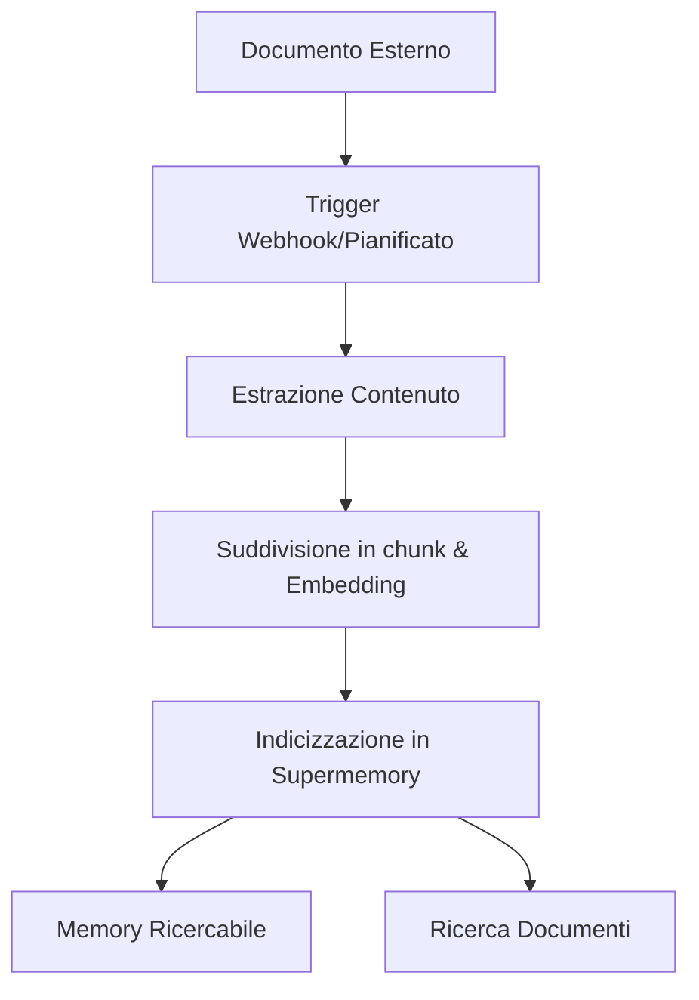

Collega piattaforme esterne per sincronizzare automaticamente i Documents in Supermemory. I connettori supportati includono Google Drive, Notion e OneDrive, con sincronizzazione in tempo reale ed elaborazione intelligente dei contenuti.

<div id="supported-connectors">
  ## Connettori supportati
</div>

<CardGroup cols={3}>
  <Card title="Google Drive" icon="google-drive" href="/it/connectors/google-drive">
    **Google Docs, Slides, Sheets**

    Sincronizzazione in tempo reale tramite webhooks. Supporta unità condivise, cartelle annidate e documenti collaborativi.
  </Card>

  <Card title="Notion" icon="notion" href="/it/connectors/notion">
    **Pagine, database, blocchi**

    Sincronizzazione istantanea dei contenuti dello spazio di lavoro. Gestisce formattazione avanzata, incorporamenti ed elementi dei database.
  </Card>

  <Card title="OneDrive" icon="microsoft" href="/it/connectors/onedrive">
    **Word, Excel, PowerPoint**

    Sincronizzazione pianificata ogni 4 ore. Supporta account personali e aziendali con controllo delle versioni dei file.
  </Card>
</CardGroup>

<div id="quick-start">
  ## Guida rapida
</div>

<div id="1-create-connection">
  ### 1. Crea integrazione
</div>

<CodeGroup>
  ```typescript Typescript
  import Supermemory from 'supermemory';

  const client = new Supermemory({
    apiKey: process.env.SUPERMEMORY_API_KEY!
  });

  const connection = await client.connections.create('notion', {
    redirectUrl: 'https://yourapp.com/callback',
    containerTags: ['user-123', 'workspace-alpha'],
    documentLimit: 5000,
    metadata: { department: 'sales' }
  });

  // Reindirizza l'utente per completare OAuth
  console.log('URL di autenticazione:', connection.authLink);
  console.log('Scade tra:', connection.expiresIn);
  // Output: URL di autenticazione: https://api.notion.com/v1/oauth/authorize?...
  // Output: Scade tra: 1 ora
  ```

  ```python Python
  from supermemory import Supermemory
  import os

  client = Supermemory(api_key=os.environ.get("SUPERMEMORY_API_KEY"))

  connection = client.connections.create(
      'notion',
      redirect_url='https://yourapp.com/callback',
      container_tags=['user-123', 'workspace-alpha'],
      document_limit=5000,
      metadata={'department': 'sales'}
  )

  # Reindirizza l'utente per completare OAuth
  print(f'URL di autenticazione: {connection.auth_link}')
  print(f'Scade tra: {connection.expires_in}')
  # Output: URL di autenticazione: https://api.notion.com/v1/oauth/authorize?...
  # Output: Scade tra: 1 ora
  ```

  ```bash cURL
  curl -X POST "https://api.supermemory.ai/v3/connections/notion" \
    -H "Authorization: Bearer $SUPERMEMORY_API_KEY" \
    -H "Content-Type: application/json" \
    -d '{
      "redirectUrl": "https://yourapp.com/callback",
      "containerTags": ["user-123", "workspace-alpha"],
      "documentLimit": 5000,
      "metadata": {"department": "sales"}
    }'

  # Risposta: {
  #   "authLink": "https://api.notion.com/v1/oauth/authorize?...",
  #   "expiresIn": "1 ora",
  #   "id": "conn_abc123",
  #   "redirectsTo": "https://yourapp.com/callback"
  # }
  ```
</CodeGroup>

<div id="2-handle-oauth-callback">
  ### 2. Gestire il callback OAuth
</div>

Dopo che l’utente completa OAuth, l’integrazione viene creata automaticamente e la sincronizzazione inizia.

<div id="3-monitor-sync-status">
  ### 3. Monitora lo stato di sincronizzazione
</div>

<CodeGroup>
  ```typescript Typescript
  import Supermemory from 'supermemory';

  const client = new Supermemory({
    apiKey: process.env.SUPERMEMORY_API_KEY!
  });

  // Elenca tutte le integrazioni usando l'SDK
  const connections = await client.connections.list({
    containerTags: ['user-123', 'workspace-alpha']
  });

  connections.forEach(conn => {
    console.log('Integrazione:', conn.id);
    console.log('Provider:', conn.provider);
    console.log('Email:', conn.email);
    console.log('Creato il:', conn.createdAt);
  });

  // Elenca i Documents sincronizzati (memories) usando l'SDK
  const memories = await client.memories.list({
    containerTags: ['user-123', 'workspace-alpha']
  });

  console.log(`Sincronizzati ${memories.memories.length} Documents`);
  // Output: Sincronizzati 45 Documents
  ```

  ```python Python
  from supermemory import Supermemory
  import os

  client = Supermemory(api_key=os.environ.get("SUPERMEMORY_API_KEY"))

  # Elenca tutte le integrazioni usando l'SDK
  connections = client.connections.list(
      container_tags=['user-123', 'workspace-alpha']
  )

  for conn in connections:
      print(f'Integrazione: {conn.id}')
      print(f'Provider: {conn.provider}')
      print(f'Email: {conn.email}')
      print(f'Creato il: {conn.created_at}')

  # Elenca i Documents sincronizzati (memories) usando l'SDK
  memories = client.memories.list(container_tags=['user-123', 'workspace-alpha'])

  print(f'Sincronizzati {len(memories.memories)} Documents')
  # Output: Sincronizzati 45 Documents
  ```

  ```bash cURL
  # Elenca tutte le integrazioni
  curl -X POST "https://api.supermemory.ai/v3/connections/list" \
    -H "Authorization: Bearer $SUPERMEMORY_API_KEY" \
    -H "Content-Type: application/json" \
    -d '{"containerTags": ["user-123", "workspace-alpha"]}'

  # Risposta: [{"id": "conn_abc", "provider": "notion", "email": "user@example.com", ...}]

  # Elenca i Documents sincronizzati
  curl -X POST "https://api.supermemory.ai/v3/documents/list" \
    -H "Authorization: Bearer $SUPERMEMORY_API_KEY" \
    -H "Content-Type: application/json" \
    -d '{"containerTags": ["user-123", "workspace-alpha"]}'

  # Risposta: {"results": [...], "totalCount": 45}
  ```
</CodeGroup>

<div id="how-connectors-work">
  ## Come funzionano i connettori
</div>

<div id="authentication-flow">
  ### Flusso di autenticazione
</div>

1. **Crea integrazione**: chiama `/v3/connections/{provider}` per ottenere l’URL di OAuth
2. **Autorizzazione dell’utente**: reindirizza l’utente per completare il flusso di OAuth
3. **Configurazione automatica**: integrazione creata, la sincronizzazione inizia subito
4. **Sincronizzazione continua**: aggiornamenti in tempo reale via webhook + sincronizzazione pianificata ogni 4 ore

<div id="document-processing-pipeline">
  ### Pipeline di elaborazione dei documenti
</div>



<div id="sync-mechanisms">
  ### Meccanismi di sincronizzazione
</div>

| Provider | Sincronizzazione in tempo reale | Sincronizzazione pianificata | Sincronizzazione manuale |
|----------|---------------|----------------|-------------|
| **Google Drive** | ✅ Webhook (scadenza a 7 giorni) | ✅ Ogni 4 ore | ✅ Su richiesta |
| **Notion** | ✅ Webhook | ✅ Ogni 4 ore | ✅ Su richiesta |
| **OneDrive** | ✅ Webhook (scadenza a 30 giorni) | ✅ Ogni 4 ore | ✅ Su richiesta |

<div id="connection-management">
  ## Gestione delle integrazioni
</div>

<div id="list-all-connections">
  ### Elenca tutte le integrazioni
</div>

<CodeGroup>
  ```typescript Typescript
  import Supermemory from 'supermemory';

  const client = new Supermemory({
    apiKey: process.env.SUPERMEMORY_API_KEY!
  });

  const connections = await client.connections.list({
    containerTags: ['org-123']
  });
  ```

  ```python Python
  from supermemory import Supermemory
  import os

  client = Supermemory(api_key=os.environ.get("SUPERMEMORY_API_KEY"))

  connections = client.connections.list(container_tags=['org-123'])

  for conn in connections:
      print(f"{conn.provider}: {conn.email} ({conn.id})")
      print(f"Documenti: {conn.document_limit or 'illimitati'}")
      print(f"Scadenza: {conn.expires_at or 'mai'}")
  # Output: notion: user@company.com (conn_abc123)
  # Output: Documenti: 5000
  # Output: Scadenza: mai
  ```

  ```bash cURL
  curl -X POST "https://api.supermemory.ai/v3/connections/list" \
    -H "Authorization: Bearer $SUPERMEMORY_API_KEY" \
    -H "Content-Type: application/json" \
    -d '{"containerTags": ["org-123"]}'

  # Response: [
  #   {
  #     "id": "conn_abc123",
  #     "provider": "notion",
  #     "email": "user@company.com",
  #     "documentLimit": 5000,
  #     "createdAt": "2024-01-15T10:30:00.000Z"
  #   }
  # ]
  ```
</CodeGroup>

<div id="delete-connections">
  ### Eliminare integrazioni
</div>

<CodeGroup>
  ```typescript Typescript
  import Supermemory from 'supermemory';

  const client = new Supermemory({
    apiKey: process.env.SUPERMEMORY_API_KEY!
  });

  // Eliminare tramite ID dell'integrazione usando l'SDK
  const result = await client.connections.delete(connectionId);

  console.log('Eliminato:', result.id, result.provider);
  // Output: Eliminato: conn_abc123 notion
  ```

  ```python Python
  from supermemory import Supermemory
  import os

  client = Supermemory(api_key=os.environ.get("SUPERMEMORY_API_KEY"))

  # Eliminare tramite ID dell'integrazione usando l'SDK
  result = client.connections.delete(connection_id)

  print(f"Eliminato: {result.id} {result.provider}")
  # Output: Eliminato: conn_abc123 notion
  ```

  ```bash cURL
  curl -X DELETE "https://api.supermemory.ai/v3/connections/conn_abc123" \
    -H "Authorization: Bearer $SUPERMEMORY_API_KEY"

  # Response: {
  #   "id": "conn_abc123",
  #   "provider": "notion"
  # }
  ```
</CodeGroup>