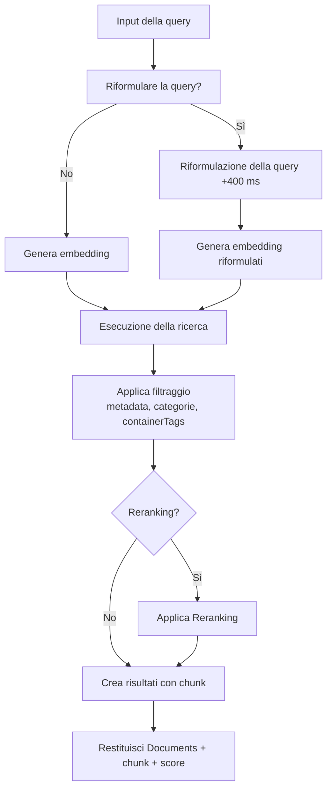
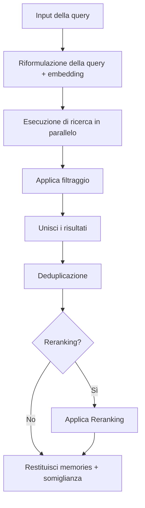

<div id="search-endpoints-overview">
  ## Panoramica degli endpoint di ricerca
</div>

<CardGroup cols={2}>
  <Card title="Documents Search - RAG veloce e avanzato" icon="settings" href="/it/search/examples/document-search">
    **POST /v3/search**

    Ricerca completa con ampio controllo su ranking, filtri, threshold e struttura dei risultati. Cerca e restituisce Documents pertinenti. Maggiore flessibilità.
  </Card>

  <Card title="Memories Search" icon="zap" href="/it/search/examples/memory-search">
    **POST /v4/search**

    Ricerca a latenza minima, ottimizzata per chatbot e AI conversazionale. Cerca e restituisce memories. Parametri semplici, risposte rapide, facile da usare.
  </Card>
</CardGroup>

<div id="documents-vs-memories-search-whats-the-difference">
  ## Ricerca tra Documents e Memories: qual è la differenza?
</div>

La differenza principale tra `/v3/search` e `/v4/search` è **Documents vs memories**. `/v3/search` effettua la ricerca nei Documents e restituisce i chunk corrispondenti, mentre `/v4/search` effettua la ricerca nelle memories, nelle preferenze e nella cronologia dell’utente.

* **Documents:** Indicano i dati che importi, come testo, PDF, video, immagini, ecc. Sono le fonti di verità.
* **Memories:** Vengono estratte automaticamente dai tuoi Documents da Supermemory. Sono piccoli chunk di informazioni dedotti dai Documents e correlati tra loro.

Consulta la [guida all’ingestion](/it/memory-api/ingesting) per saperne di più sulla differenza tra Documents e memories.

<div id="documents-search-v3search">
  ### Ricerca nei Documents (`/v3/search`)
</div>

**Ricerca di Documents di alta qualità** - parametri avanzati per ottimizzare il comportamento della ricerca:

* **Casi d&#39;uso**: usa questo endpoint quando è necessaria una ricerca di documenti “letterale”.
  * Consultazione di documenti legali/finanziari
  * Ricerca tra gli elementi in Google Drive
  * Chat con la documentazione
* Con questo endpoint hai **pieno controllo** su
  * Soglie,
  * Filtraggio
  * Reranking
  * Riformulazione della query

<Tabs>
  <Tab title="TypeScript">
    ```typescript
    // Documents search
    const results = await client.search.documents({
      q: "machine learning accuracy",
      limit: 10,
      documentThreshold: 0.7,
      chunkThreshold: 0.8,
      rerank: true,
      rewriteQuery: true,
      includeFullDocs: true,
      includeSummary: true,
      onlyMatchingChunks: false,
      containerTags: ["research"],
      filters: {
        AND: [{ key: "category", value: "ai", negate: false }]
      }
    });
    ```
  </Tab>

  <Tab title="Python">
    ```python
    # Documents search
    results = client.search.documents(
        q="machine learning accuracy",
        limit=10,
        document_threshold=0.7,
        chunk_threshold=0.8,
        rerank=True,
        rewrite_query=True,
        include_full_docs=True,
        include_summary=True,
        only_matching_chunks=False,
        container_tags=["research"],
        filters={
            "AND": [{"key": "category", "value": "ai", "negate": False}]
        }
    )
    ```
  </Tab>

  <Tab title="cURL">
    ```bash
    curl -X POST "https://api.supermemory.ai/v3/search" \
      -H "Authorization: Bearer $SUPERMEMORY_API_KEY" \
      -H "Content-Type: application/json" \
      -d '{
        "q": "machine learning accuracy",
        "limit": 10,
        "documentThreshold": 0.7,
        "chunkThreshold": 0.8,
        "rerank": true,
        "rewriteQuery": true,
        "includeFullDocs": true,
        "includeSummary": true,
        "onlyMatchingChunks": false,
        "containerTags": ["research"],
        "filters": {
          "AND": [{"key": "category", "value": "ai", "negate": false}]
        }
      }'
    ```
  </Tab>
</Tabs>

```json Sample Response

{
  "results": [
    {
      "documentId": "doc_abc123",
      "title": "Fondamenti di machine learning",
      "type": "pdf",
      "score": 0.89,
      "chunks": [
        {
          "content": "Il machine learning è un sottoinsieme dell’intelligenza artificiale...",
          "score": 0.95,
          "isRelevant": true
        }
      ],
      "metadata": {
        "category": "education",
        "author": "Dr. Smith",
        "difficulty": "beginner"
      },
      "createdAt": "2024-01-15T10:30:00Z",
      "updatedAt": "2024-01-20T14:45:00Z"
    }
  ],
  "timing": 187,
  "total": 1
}
```

L&#39;endpoint `/v3/search` restituisce i Documents più rilevanti e i chunk tratti da tali Documents. Consulta la pagina dello [schema della risposta](/it/search/response-schema) per approfondire la struttura della risposta.

<div id="memories-search-v4search">
  ### Ricerca nelle memories (`/v4/search`)
</div>

**Cerca tra le memory dell’utente**:

* **Casi d’uso**: Usa questo endpoint quando comprendere il contesto, le preferenze e le memory dell’utente è più importante della ricerca letterale nei documenti.
  * Chatbot personalizzati (AI Companions)
  * Selezione automatica in base a ciò che l’utente desidera
  * Impostazione del tono della conversazione

Aziende come Composio e [Rube.app](https://rube.app) utilizzano la ricerca nelle memories per consentire all’MCP di automatizzare meglio sulla base dei prompt precedenti dell’utente.

<Info>
  Questo endpoint è ideale per casi d’uso di AI conversazionale, come i chatbot.
</Info>

<Tabs>
  <Tab title="TypeScript">
    ```typescript
    // Memories search
    const results = await client.search.memories({
      q: "machine learning accuracy",
      limit: 5,
      containerTag: "research",
      threshold: 0.7,
      rerank: true
    });
    ```
  </Tab>

  <Tab title="Python">
    ```python
    # Memories search
    results = client.search.memories(
        q="machine learning accuracy",
        limit=5,
        container_tag="research",
        threshold=0.7,
        rerank=True
    )
    ```
  </Tab>

  <Tab title="cURL">
    ```bash
    curl -X POST "https://api.supermemory.ai/v4/search" \
      -H "Authorization: Bearer $SUPERMEMORY_API_KEY" \
      -H "Content-Type: application/json" \
      -d '{
        "q": "machine learning accuracy",
        "limit": 5,
        "containerTag": "research",
        "threshold": 0.7,
        "rerank": true
      }'
    ```
  </Tab>
</Tabs>

```json Sample Response
{
  "results": [
    {
      "id": "mem_xyz789",
      "memory": "Contenuto completo della memory sulle applicazioni del computing quantistico...",
      "similarity": 0.87,
      "metadata": {
        "category": "research",
        "topic": "quantum-computing"
      },
      "updatedAt": "2024-01-18T09:15:00Z",
      "version": 3,
      "context": {
        "parents": [
          {
            "memory": "Discussione precedente sui fondamenti della teoria quantistica...",
            "relation": "extends",
            "version": 2,
            "updatedAt": "2024-01-17T16:30:00Z"
          }
        ],
        "children": [
          {
            "memory": "Domande di follow‑up sugli algoritmi quantistici...",
            "relation": "derives",
            "version": 4,
            "updatedAt": "2024-01-19T11:20:00Z"
          }
        ]
      },
      "documents": [
        {
          "id": "doc_quantum_paper",
          "title": "Applicazioni del computing quantistico"
          "type": "pdf",
          "createdAt": "2024-01-10T08:00:00Z"
        }
      ]
    }
  ],
  "timing": 156,
  "total": 1
}

```

L&#39;endpoint `/v4/search` esegue ricerche e restituisce memories.

<div id="search-flow-architecture">
  ## Architettura del flusso di ricerca
</div>

<div id="document-search-v3search-flow">
  ### Flusso di ricerca dei documenti (`/v3/search`)
</div>



<div id="memory-search-v4search-flow">
  ### Flusso di ricerca delle memory (`/v4/search`)
</div>



<div id="key-concepts-you-need-to-understand">
  ## Concetti chiave da conoscere
</div>

<div id="1-thresholds-sensitivity-control">
  ### 1. Threshold (controllo della sensibilità)
</div>

I threshold regolano il compromesso tra qualità e quantità dei risultati:

* **0.0** = Minima sensibilità (più risultati, qualità inferiore)
* **1.0** = Massima sensibilità (meno risultati, qualità superiore)

```typescript
// Strategie di threshold differenti
const broadSearch = await client.search.documents({
  q: "machine learning",
  chunkThreshold: 0.2,      // Restituisce più chunk
  documentThreshold: 0.1    // Da più Documents
});

const preciseSearch = await client.search.documents({
  q: "machine learning",
  chunkThreshold: 0.8,      // Solo chunk altamente rilevanti
  documentThreshold: 0.7    // Da Documents con corrispondenza stretta
});
```

<div id="2-chunk-context-vs-exact-matching">
  ### 2. Contesto dei chunk vs corrispondenza esatta
</div>

Per impostazione predefinita, Supermemory restituisce chunk **con contesto** (testo circostante):

```typescript
// Predefinito: include i chunk circostanti come contesto
const contextualResults = await client.search.documents({
  q: "neural networks",
  onlyMatchingChunks: false  // Predefinito
});

// Preciso: solo il testo che corrisponde esattamente
const exactResults = await client.search.documents({
  q: "neural networks",
  onlyMatchingChunks: true
});
```

### 3. Riformulazione della query &amp; Reranking

**Riformulazione della query** (+400 ms di latency):

* Amplia la query per trovare risultati più pertinenti
* &quot;ML&quot; diventa &quot;machine learning intelligenza artificiale&quot;
* Utile per abbreviazioni e termini specifici del dominio

**Reranking**:

* Riassegna il punteggio ai risultati usando un algoritmo diverso
* Più accurato ma più lento
* Consigliato per ricerche critiche

<div id="4-container-tags-vs-metadata-filters">
  ### 4. Container Tags vs Metadata Filters
</div>

Due meccanismi di filtraggio diversi:

Quando utilizzare i container tags:

* Il grafo di comprensione dell’utente è costruito sui container tags. **Il grafo è costruito sui container tags.**
  * I container tags sono usati per il raggruppamento organizzativo e le corrispondenze esatte.
  * Sono utili per categorizzare i contenuti e garantire risultati precisi.
    Quando utilizzare i metadata filters:
  * Quando servono condizioni flessibili oltre alle corrispondenze esatte.
  * Utile per filtrare per attributi come data, autore o categoria.

```typescript
// Container tag: raggruppamento organizzativo (corrispondenza esatta dell’array)
const userContent = await client.search.documents({
  q: "tutorial python",
  containerTag: "user_123"  // Deve corrispondere esattamente
});

// Metadata filters: query basate su SQL (condizioni flessibili)
const filteredContent = await client.search.documents({
  q: "tutorial python",
  filters: JSON.stringify({
    AND: [
      { key: "language", value: "python", negate: false },
      { key: "difficulty", value: "beginner", negate: false }
    ]
  })
});
```
