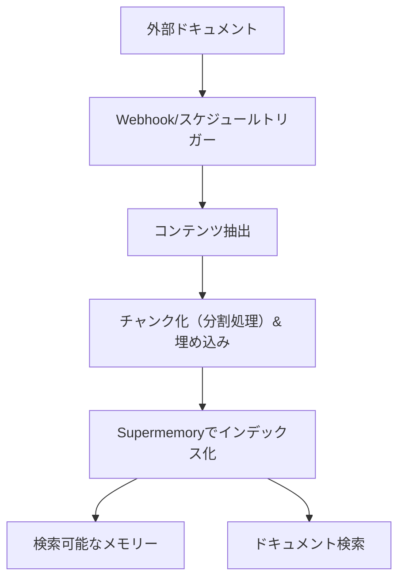

外部プラットフォームを接続して、documents を Supermemory に自動同期します。対応コネクタには Google Drive、Notion、OneDrive があり、リアルタイム同期とインテリジェントなコンテンツ処理に対応しています。

<div id="supported-connectors">
  ## 対応コネクタ
</div>

<CardGroup cols={3}>
  <Card title="Google Drive" icon="google-drive" href="/ja/connectors/google-drive">
    **Google ドキュメント、スライド、スプレッドシート**

    Webhook によるリアルタイム同期。共有ドライブ、階層フォルダ、共同編集ドキュメントに対応。
  </Card>

  <Card title="Notion" icon="notion" href="/ja/connectors/notion">
    **ページ、データベース、ブロック**

    ワークスペース内コンテンツを即時同期。リッチテキスト、埋め込み、データベースのプロパティに対応。
  </Card>

  <Card title="OneDrive" icon="microsoft" href="/ja/connectors/onedrive">
    **Word、Excel、PowerPoint**

    4時間ごとのスケジュール同期。個人アカウントおよび法人アカウントに対応し、ファイルのバージョン管理をサポート。
  </Card>
</CardGroup>

<div id="quick-start">
  ## クイックスタート
</div>

<div id="1-create-connection">
  ### 1. 連携を作成
</div>

<CodeGroup>
  ```typescript Typescript
  import Supermemory from 'supermemory';

  const client = new Supermemory({
    apiKey: process.env.SUPERMEMORY_API_KEY!
  });

  const connection = await client.connections.create('notion', {
    redirectUrl: 'https://yourapp.com/callback',
    containerTags: ['user-123', 'workspace-alpha'],
    documentLimit: 5000,
    metadata: { department: 'sales' }
  });

  // ユーザーをリダイレクトして OAuth 認可を完了させる
  console.log('認可 URL:', connection.authLink);
  console.log('有効期限:', connection.expiresIn);
  // 出力: 認可 URL: https://api.notion.com/v1/oauth/authorize?...
  // 出力: 有効期限: 1 hour
  ```

  ```python Python
  from supermemory import Supermemory
  import os

  client = Supermemory(api_key=os.environ.get("SUPERMEMORY_API_KEY"))

  connection = client.connections.create(
      'notion',
      redirect_url='https://yourapp.com/callback',
      container_tags=['user-123', 'workspace-alpha'],
      document_limit=5000,
      metadata={'department': 'sales'}
  )

  # ユーザーをリダイレクトして OAuth 認可を完了させる
  print(f'認可 URL: {connection.auth_link}')
  print(f'有効期限: {connection.expires_in}')
  # 出力: 認可 URL: https://api.notion.com/v1/oauth/authorize?...
  # 出力: 有効期限: 1 hour
  ```

  ```bash cURL
  curl -X POST "https://api.supermemory.ai/v3/connections/notion" \
    -H "Authorization: Bearer $SUPERMEMORY_API_KEY" \
    -H "Content-Type: application/json" \
    -d '{
      "redirectUrl": "https://yourapp.com/callback",
      "containerTags": ["user-123", "workspace-alpha"],
      "documentLimit": 5000,
      "metadata": {"department": "sales"}
    }'

  # レスポンス: {
  #   "authLink": "https://api.notion.com/v1/oauth/authorize?...",
  #   "expiresIn": "1 hour",
  #   "id": "conn_abc123",
  #   "redirectsTo": "https://yourapp.com/callback"
  # }
  ```
</CodeGroup>

<div id="2-handle-oauth-callback">
  ### 2. OAuth コールバックを処理する
</div>

ユーザーによる OAuth の完了後、連携は自動的に確立され、同期が開始されます。

<div id="3-monitor-sync-status">
  ### 3. 同期ステータスの監視
</div>

<CodeGroup>
  ```typescript Typescript
  import Supermemory from 'supermemory';

  const client = new Supermemory({
    apiKey: process.env.SUPERMEMORY_API_KEY!
  });

  // SDK を使ってすべての連携を一覧取得
  const connections = await client.connections.list({
    containerTags: ['user-123', 'workspace-alpha']
  });

  connections.forEach(conn => {
    console.log('Connection:', conn.id);
    console.log('Provider:', conn.provider);
    console.log('Email:', conn.email);
    console.log('Created:', conn.createdAt);
  });

  // SDK を使って同期済みの documents（保存メモリ）を一覧取得
  const memories = await client.memories.list({
    containerTags: ['user-123', 'workspace-alpha']
  });

  console.log(`Synced ${memories.memories.length} documents`);
  // 出力: Synced 45 documents
  ```

  ```python Python
  from supermemory import Supermemory
  import os

  client = Supermemory(api_key=os.environ.get("SUPERMEMORY_API_KEY"))

  # SDK を使ってすべての連携を一覧取得
  connections = client.connections.list(
      container_tags=['user-123', 'workspace-alpha']
  )

  for conn in connections:
      print(f'Connection: {conn.id}')
      print(f'Provider: {conn.provider}')
      print(f'Email: {conn.email}')
      print(f'Created: {conn.created_at}')

  # SDK を使って同期済みの documents（保存メモリ）を一覧取得
  memories = client.memories.list(container_tags=['user-123', 'workspace-alpha'])

  print(f'Synced {len(memories.memories)} documents')
  # 出力: Synced 45 documents
  ```

  ```bash cURL
  # すべての連携を一覧取得
  curl -X POST "https://api.supermemory.ai/v3/connections/list" \
    -H "Authorization: Bearer $SUPERMEMORY_API_KEY" \
    -H "Content-Type: application/json" \
    -d '{"containerTags": ["user-123", "workspace-alpha"]}'

  # レスポンス: [{"id": "conn_abc", "provider": "notion", "email": "user@example.com", ...}]

  # 同期済みの documents を一覧取得
  curl -X POST "https://api.supermemory.ai/v3/documents/list" \
    -H "Authorization: Bearer $SUPERMEMORY_API_KEY" \
    -H "Content-Type: application/json" \
    -d '{"containerTags": ["user-123", "workspace-alpha"]}'

  # レスポンス: {"results": [...], "totalCount": 45}
  ```
</CodeGroup>

<div id="how-connectors-work">
  ## コネクタの動作原理
</div>

<div id="authentication-flow">
  ### 認証フロー
</div>

1. **連携の作成**: `/v3/connections/{provider}` を呼び出して OAuth の URL を取得
2. **ユーザー認可**: ユーザーをリダイレクトして OAuth フローを完了
3. **自動セットアップ**: 連携が確立され、同期が直ちに開始
4. **継続的な同期**: Webhook によるリアルタイム更新 + 4時間ごとの定期同期

<div id="document-processing-pipeline">
  ### ドキュメント処理パイプライン
</div>



<div id="sync-mechanisms">
  ### 同期メカニズム
</div>

| プロバイダ | リアルタイム同期 | スケジュール同期 | 手動同期 |
|----------|---------------|----------------|-------------|
| **Google Drive** | ✅ Webhook（有効期限7日） | ✅ 4時間ごと | ✅ オンデマンド |
| **Notion** | ✅ Webhook | ✅ 4時間ごと | ✅ オンデマンド |
| **OneDrive** | ✅ Webhook（有効期限30日） | ✅ 4時間ごと | ✅ オンデマンド |

<div id="connection-management">
  ## 連携管理
</div>

<div id="list-all-connections">
  ### 連携の一覧取得
</div>

<CodeGroup>
  ```typescript Typescript
  import Supermemory from 'supermemory';

  const client = new Supermemory({
    apiKey: process.env.SUPERMEMORY_API_KEY!
  });

  const connections = await client.connections.list({
    containerTags: ['org-123']
  });
  ```

  ```python Python
  from supermemory import Supermemory
  import os

  client = Supermemory(api_key=os.environ.get("SUPERMEMORY_API_KEY"))

  connections = client.connections.list(container_tags=['org-123'])

  for conn in connections:
      print(f"{conn.provider}: {conn.email} ({conn.id})")
      print(f"Documents: {conn.document_limit or 'unlimited'}")
      print(f"Expires: {conn.expires_at or 'never'}")
  # 出力例: notion: user@company.com (conn_abc123)
  # 出力例: Documents: 5000
  # 出力例: Expires: never
  ```

  ```bash cURL
  curl -X POST "https://api.supermemory.ai/v3/connections/list" \
    -H "Authorization: Bearer $SUPERMEMORY_API_KEY" \
    -H "Content-Type: application/json" \
    -d '{"containerTags": ["org-123"]}'

  # レスポンス: [
  #   {
  #     "id": "conn_abc123",
  #     "provider": "notion",
  #     "email": "user@company.com",
  #     "documentLimit": 5000,
  #     "createdAt": "2024-01-15T10:30:00.000Z"
  #   }
  # ]
  ```
</CodeGroup>

<div id="delete-connections">
  ### 連携を削除する
</div>

<CodeGroup>
  ```typescript Typescript
  import Supermemory from 'supermemory';

  const client = new Supermemory({
    apiKey: process.env.SUPERMEMORY_API_KEY!
  });

  // SDK を使って連携 ID で削除
  const result = await client.connections.delete(connectionId);

  console.log('Deleted:', result.id, result.provider);
  // 出力: Deleted: conn_abc123 notion
  ```

  ```python Python
  from supermemory import Supermemory
  import os

  client = Supermemory(api_key=os.environ.get("SUPERMEMORY_API_KEY"))

  # SDK を使って連携 ID で削除
  result = client.connections.delete(connection_id)

  print(f"Deleted: {result.id} {result.provider}")
  # 出力: Deleted: conn_abc123 notion
  ```

  ```bash cURL
  curl -X DELETE "https://api.supermemory.ai/v3/connections/conn_abc123" \
    -H "Authorization: Bearer $SUPERMEMORY_API_KEY"

  # レスポンス: {
  #   "id": "conn_abc123",
  #   "provider": "notion"
  # }
  ```
</CodeGroup>