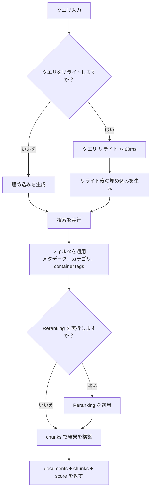
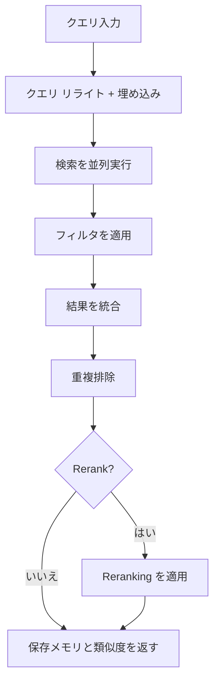

<div id="search-endpoints-overview">
  ## 検索エンドポイントの概要
</div>

<CardGroup cols={2}>
  <Card title="Documents 検索 - 高速・高度な RAG" icon="settings" href="/ja/search/examples/document-search">
    **POST /v3/search**

    ランキング、フィルタリング、threshold、結果構造まで細かく制御できるフル機能の検索。documents 全体を横断して検索し、関連するものを返します。柔軟性に優れています。
  </Card>

  <Card title="Memories 検索" icon="zap" href="/ja/search/examples/memory-search">
    **POST /v4/search**

    チャットボットや会話型 AI に最適化された低レイテンシー検索。保存メモリを横断して検索し、結果を返します。パラメータがシンプルで、応答が速く、使いやすい設計です。
  </Card>
</CardGroup>

<div id="documents-vs-memories-search-whats-the-difference">
  ## Documents と Memories の検索：何が違うのか？
</div>

`/v3/search` と `/v4/search` の主な違いは **documents と memories** です。`/v3/search` は documents を検索して一致する chunks を返し、`/v4/search` はユーザーのメモリー、プリファレンス、履歴を検索します。

* **Documents:** テキスト、PDF、動画、画像など、取り込むデータを指します。信頼できるソース（グラウンドトゥルース）です。
* **Memories:** Supermemory が documents から自動的に抽出します。documents から推論された、小さな情報の chunks で、相互に関連づけられています。

documents と 保存メモリ の違いについては、[ingestion ガイド](/ja/memory-api/ingesting)を参照してください。

<div id="documents-search-v3search">
  ### Documents Search (`/v3/search`)
</div>

**高品質な documents 検索** — 検索動作を細かく調整できる豊富なパラメーター:

* **ユースケース**: 「文字通りの」ドキュメント検索が必要な場面で使用します。
  * 法務・財務ドキュメントの精査
  * Google Drive 内のアイテム検索
  * ドキュメントと対話（チャット）
* このエンドポイントでは次を**完全に制御**できます
  * しきい値
  * フィルタリング
  * Reranking
  * クエリ リライト

<Tabs>
  <Tab title="TypeScript">
    ```typescript
    // Documents search
    const results = await client.search.documents({
      q: "machine learning accuracy",
      limit: 10,
      documentThreshold: 0.7,
      chunkThreshold: 0.8,
      rerank: true,
      rewriteQuery: true,
      includeFullDocs: true,
      includeSummary: true,
      onlyMatchingChunks: false,
      containerTags: ["research"],
      filters: {
        AND: [{ key: "category", value: "ai", negate: false }]
      }
    });
    ```
  </Tab>

  <Tab title="Python">
    ```python
    # Documents search
    results = client.search.documents(
        q="machine learning accuracy",
        limit=10,
        document_threshold=0.7,
        chunk_threshold=0.8,
        rerank=True,
        rewrite_query=True,
        include_full_docs=True,
        include_summary=True,
        only_matching_chunks=False,
        container_tags=["research"],
        filters={
            "AND": [{"key": "category", "value": "ai", "negate": False}]
        }
    )
    ```
  </Tab>

  <Tab title="cURL">
    ```bash
    curl -X POST "https://api.supermemory.ai/v3/search" \
      -H "Authorization: Bearer $SUPERMEMORY_API_KEY" \
      -H "Content-Type: application/json" \
      -d '{
        "q": "machine learning accuracy",
        "limit": 10,
        "documentThreshold": 0.7,
        "chunkThreshold": 0.8,
        "rerank": true,
        "rewriteQuery": true,
        "includeFullDocs": true,
        "includeSummary": true,
        "onlyMatchingChunks": false,
        "containerTags": ["research"],
        "filters": {
          "AND": [{"key": "category", "value": "ai", "negate": false}]
        }
      }'
    ```
  </Tab>
</Tabs>

```json Sample Response

{
  "results": [
    {
      "documentId": "doc_abc123",
      "title": "機械学習の基礎",
      "type": "pdf",
      "score": 0.89,
      "chunks": [
        {
          "content": "機械学習は人工知能の一領域です...",
          "score": 0.95,
          "isRelevant": true
        }
      ],
      "metadata": {
        "category": "education",
        "author": "Dr. Smith",
        "difficulty": "beginner"
      },
      "createdAt": "2024-01-15T10:30:00Z",
      "updatedAt": "2024-01-20T14:45:00Z"
    }
  ],
  "timing": 187,
  "total": 1
}
```

`/v3/search` エンドポイントは、最も関連性の高い documents と、それらの documents 内の chunks を返します。レスポンスの構造については、[response schema](/ja/search/response-schema) ページをご参照ください。

<div id="memories-search-v4search">
  ### メモリー検索 (`/v4/search`)
</div>

**ユーザーのメモリーを検索**:

* **ユースケース**: このエンドポイントは、逐語的なドキュメント検索よりも、ユーザーのコンテキスト／嗜好／メモリーの理解が重要な場面で使用します。
  * パーソナライズされたチャットボット（AIコンパニオン）
  * ユーザーの意図に基づく自動選択
  * 会話のトーン設定

Composio や [Rube.app](https://rube.app) のような企業は、過去のユーザープロンプトに基づいて MCP がより適切に自動化できるよう、メモリー検索を活用しています。

<Info>
  このエンドポイントは、チャットボットなどの会話型AIのユースケースで最も効果を発揮します。
</Info>

<Tabs>
  <Tab title="TypeScript">
    ```typescript
    // Memories search
    const results = await client.search.memories({
      q: "machine learning accuracy",
      limit: 5,
      containerTag: "research",
      threshold: 0.7,
      rerank: true
    });
    ```
  </Tab>

  <Tab title="Python">
    ```python
    # Memories search
    results = client.search.memories(
        q="machine learning accuracy",
        limit=5,
        container_tag="research",
        threshold=0.7,
        rerank=True
    )
    ```
  </Tab>

  <Tab title="cURL">
    ```bash
    curl -X POST "https://api.supermemory.ai/v4/search" \
      -H "Authorization: Bearer $SUPERMEMORY_API_KEY" \
      -H "Content-Type: application/json" \
      -d '{
        "q": "machine learning accuracy",
        "limit": 5,
        "containerTag": "research",
        "threshold": 0.7,
        "rerank": true
      }'
    ```
  </Tab>
</Tabs>

```json Sample Response
{
  "results": [
    {
      "id": "mem_xyz789",
      "memory": "量子コンピューティングの応用に関するメモリーの完全な内容...",
      "similarity": 0.87,
      "metadata": {
        "category": "research",
        "topic": "quantum-computing"
      },
      "updatedAt": "2024-01-18T09:15:00Z",
      "version": 3,
      "context": {
        "parents": [
          {
            "memory": "量子論の基礎についての以前の議論...",
            "relation": "extends",
            "version": 2,
            "updatedAt": "2024-01-17T16:30:00Z"
          }
        ],
        "children": [
          {
            "memory": "量子アルゴリズムに関する追質問...",
            "relation": "derives",
            "version": 4,
            "updatedAt": "2024-01-19T11:20:00Z"
          }
        ]
      },
      "documents": [
        {
          "id": "doc_quantum_paper",
          "title": "量子コンピューティングの応用"
          "type": "pdf",
          "createdAt": "2024-01-10T08:00:00Z"
        }
      ]
    }
  ],
  "timing": 156,
  "total": 1
}

```

`/v4/search` エンドポイントは、保存メモリを検索して返します。

<div id="search-flow-architecture">
  ## 検索フローのアーキテクチャ
</div>

<div id="document-search-v3search-flow">
  ### ドキュメント検索（`/v3/search`）のフロー
</div>



<div id="memory-search-v4search-flow">
  ### メモリー検索（`/v4/search`）フロー
</div>



<div id="key-concepts-you-need-to-understand">
  ## 理解しておきたい重要な概念
</div>

<div id="1-thresholds-sensitivity-control">
  ### 1. threshold（感度の制御）
</div>

threshold は、結果の質と量のバランスを調整します：

* **0.0** = 最低感度（結果は多いが、品質は低い）
* **1.0** = 最高感度（結果は少ないが、品質は高い）

```typescript
// しきい値の使い分け
const broadSearch = await client.search.documents({
  q: "machine learning",
  chunkThreshold: 0.2,      // より多くの chunks を返す
  documentThreshold: 0.1    // より多くの documents を対象にする
});

const preciseSearch = await client.search.documents({
  q: "machine learning",
  chunkThreshold: 0.8,      // 関連度の高い chunks のみ
  documentThreshold: 0.7    // 一致度の高い documents を対象にする
});
```

<div id="2-chunk-context-vs-exact-matching">
  ### 2. chunks のコンテキスト vs 厳密一致
</div>

デフォルトでは、Supermemory は chunks を**コンテキスト付き**（前後のテキストを含む）で返します。

```typescript
// デフォルト: 文脈用に周辺のchunksを含める
const contextualResults = await client.search.documents({
  q: "neural networks",
  onlyMatchingChunks: false  // デフォルト
});

// 精密: 完全一致するテキストのみ
const exactResults = await client.search.documents({
  q: "neural networks",
  onlyMatchingChunks: true
});
```

### 3. クエリ リライト &amp; Reranking

**クエリ リライト**（+400ms レイテンシー）:

* クエリを拡張して、より関連性の高い結果を見つけます
* &quot;ML&quot; を &quot;machine learning artificial intelligence&quot; に展開します
* 略語やドメイン固有の用語に有効

**Reranking**:

* 別のアルゴリズムで結果を再スコアリングします
* 精度は高まりますが、処理は遅くなります
* 重要度の高い検索に推奨

<div id="4-container-tags-vs-metadata-filters">
  ### 4. コンテナタグ と メタデータ filters の比較
</div>

2つの異なるフィルタリングメカニズム:

コンテナタグを使用するタイミング:

* ユーザー理解グラフはコンテナタグを基盤として構築されています。**グラフはコンテナタグを基盤として形成されます。**
  * コンテナタグは組織的なグルーピングと厳密一致に使用します。
  * コンテンツのカテゴリ分けと精密な結果の確保に有用です。
    メタデータ filters を使用するタイミング:
  * 厳密一致を超える柔軟な条件が必要な場合。
  * 日付、author、category といった属性での絞り込みに有用です。

```typescript
// コンテナタグ：組織的なグルーピング（配列の完全一致）
const userContent = await client.search.documents({
  q: "python tutorial",
  containerTag: "user_123"  // 完全一致が必要
});

// メタデータ filters：SQL ベースのクエリ（柔軟な条件）
const filteredContent = await client.search.documents({
  q: "python tutorial",
  filters: JSON.stringify({
    AND: [
      { key: "language", value: "python", negate: false },
      { key: "difficulty", value: "beginner", negate: false }
    ]
  })
});
```
