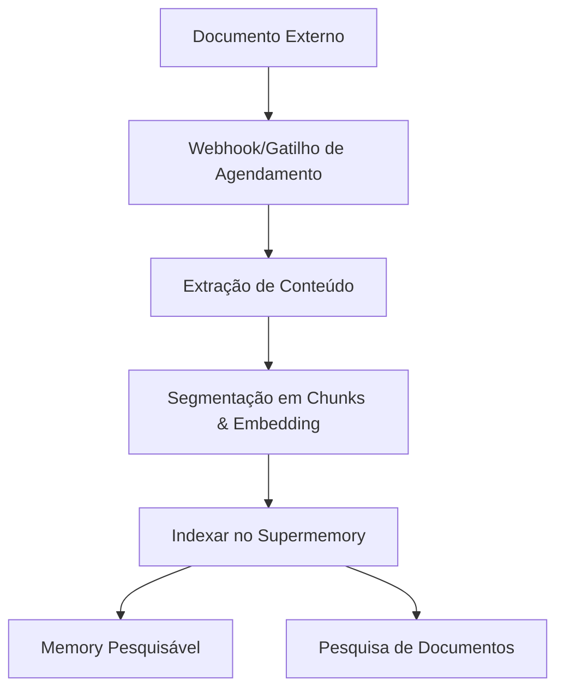

Conecte plataformas externas para sincronizar automaticamente documents no Supermemory. Os conectores compatíveis incluem Google Drive, Notion e OneDrive, com sincronização em tempo real e processamento inteligente de conteúdo.

<div id="supported-connectors">
  ## Conectores compatíveis
</div>

<CardGroup cols={3}>
  <Card title="Google Drive" icon="google-drive" href="/pt-BR/connectors/google-drive">
    **Google Docs, Slides, Sheets**

    Sincronização em tempo real via webhooks. Suporta unidades compartilhadas, pastas aninhadas e documentos colaborativos.
  </Card>

  <Card title="Notion" icon="notion" href="/pt-BR/connectors/notion">
    **Páginas, bancos de dados, blocos**

    Sincronização instantânea do conteúdo do workspace. Suporta formatação rica, incorporações e propriedades de banco de dados.
  </Card>

  <Card title="OneDrive" icon="microsoft" href="/pt-BR/connectors/onedrive">
    **Word, Excel, PowerPoint**

    Sincronização programada a cada 4 horas. Suporta contas pessoais e empresariais, com controle de versão de arquivos.
  </Card>
</CardGroup>

<div id="quick-start">
  ## Guia Rápido
</div>

<div id="1-create-connection">
  ### 1. Criar integração
</div>

<CodeGroup>
  ```typescript Typescript
  import Supermemory from 'supermemory';

  const client = new Supermemory({
    apiKey: process.env.SUPERMEMORY_API_KEY!
  });

  const connection = await client.connections.create('notion', {
    redirectUrl: 'https://yourapp.com/callback',
    containerTags: ['user-123', 'workspace-alpha'],
    documentLimit: 5000,
    metadata: { department: 'sales' }
  });

  // Redirecione o usuário para concluir o OAuth
  console.log('URL de autenticação:', connection.authLink);
  console.log('Expira em:', connection.expiresIn);
  // Saída: URL de autenticação: https://api.notion.com/v1/oauth/authorize?...
  // Saída: Expira em: 1 hora
  ```

  ```python Python
  from supermemory import Supermemory
  import os

  client = Supermemory(api_key=os.environ.get("SUPERMEMORY_API_KEY"))

  connection = client.connections.create(
      'notion',
      redirect_url='https://yourapp.com/callback',
      container_tags=['user-123', 'workspace-alpha'],
      document_limit=5000,
      metadata={'department': 'sales'}
  )

  # Redirecione o usuário para concluir o OAuth
  print(f'URL de autenticação: {connection.auth_link}')
  print(f'Expira em: {connection.expires_in}')
  # Saída: URL de autenticação: https://api.notion.com/v1/oauth/authorize?...
  # Saída: Expira em: 1 hora
  ```

  ```bash cURL
  curl -X POST "https://api.supermemory.ai/v3/connections/notion" \
    -H "Authorization: Bearer $SUPERMEMORY_API_KEY" \
    -H "Content-Type: application/json" \
    -d '{
      "redirectUrl": "https://yourapp.com/callback",
      "containerTags": ["user-123", "workspace-alpha"],
      "documentLimit": 5000,
      "metadata": {"department": "sales"}
    }'

  # Resposta: {
  #   "authLink": "https://api.notion.com/v1/oauth/authorize?...",
  #   "expiresIn": "1 hora",
  #   "id": "conn_abc123",
  #   "redirectsTo": "https://yourapp.com/callback"
  # }
  ```
</CodeGroup>

<div id="2-handle-oauth-callback">
  ### 2. Tratar o callback do OAuth
</div>

Após o usuário concluir o OAuth, a integração é estabelecida automaticamente e a sincronização é iniciada.

<div id="3-monitor-sync-status">
  ### 3. Monitorar o status de sincronização
</div>

<CodeGroup>
  ```typescript Typescript
  import Supermemory from 'supermemory';

  const client = new Supermemory({
    apiKey: process.env.SUPERMEMORY_API_KEY!
  });

  // Listar todas as integrações usando o SDK
  const connections = await client.connections.list({
    containerTags: ['user-123', 'workspace-alpha']
  });

  connections.forEach(conn => {
    console.log('Integração:', conn.id);
    console.log('Provider:', conn.provider);
    console.log('Email:', conn.email);
    console.log('Criado em:', conn.createdAt);
  });

  // Listar documentos sincronizados (memories) usando o SDK
  const memories = await client.memories.list({
    containerTags: ['user-123', 'workspace-alpha']
  });

  console.log(`Sincronizados ${memories.memories.length} documentos`);
  // Saída: Sincronizados 45 documentos
  ```

  ```python Python
  from supermemory import Supermemory
  import os

  client = Supermemory(api_key=os.environ.get("SUPERMEMORY_API_KEY"))

  # Listar todas as integrações usando o SDK
  connections = client.connections.list(
      container_tags=['user-123', 'workspace-alpha']
  )

  for conn in connections:
      print(f'Integração: {conn.id}')
      print(f'Provider: {conn.provider}')
      print(f'Email: {conn.email}')
      print(f'Criado em: {conn.created_at}')

  # Listar documentos sincronizados (memories) usando o SDK
  memories = client.memories.list(container_tags=['user-123', 'workspace-alpha'])

  print(f'Sincronizados {len(memories.memories)} documentos')
  # Saída: Sincronizados 45 documentos
  ```

  ```bash cURL
  # Listar todas as integrações
  curl -X POST "https://api.supermemory.ai/v3/connections/list" \
    -H "Authorization: Bearer $SUPERMEMORY_API_KEY" \
    -H "Content-Type: application/json" \
    -d '{"containerTags": ["user-123", "workspace-alpha"]}'

  # Resposta: [{"id": "conn_abc", "provider": "notion", "email": "user@example.com", ...}]

  # Listar documentos sincronizados
  curl -X POST "https://api.supermemory.ai/v3/documents/list" \
    -H "Authorization: Bearer $SUPERMEMORY_API_KEY" \
    -H "Content-Type: application/json" \
    -d '{"containerTags": ["user-123", "workspace-alpha"]}'

  # Resposta: {"results": [...], "totalCount": 45}
  ```
</CodeGroup>

<div id="how-connectors-work">
  ## Como os Connectors funcionam
</div>

<div id="authentication-flow">
  ### Fluxo de autenticação
</div>

1. **Criar integração**: Chame `/v3/connections/{provider}` para obter a url de OAuth
2. **Autorização do usuário**: Redirecione o usuário para concluir o fluxo de OAuth
3. **Configuração automática**: Integração estabelecida; a sincronização começa imediatamente
4. **Sincronização contínua**: Atualizações em tempo real via webhooks + sincronização programada a cada 4 horas

<div id="document-processing-pipeline">
  ### Pipeline de processamento de documentos
</div>



<div id="sync-mechanisms">
  ### Mecanismos de sincronização
</div>

| Provider | Sincronização em tempo real | Sincronização programada | Sincronização manual |
|----------|---------------|----------------|-------------|
| **Google Drive** | ✅ Webhooks (validade de 7 dias) | ✅ A cada 4 horas | ✅ Sob demanda |
| **Notion** | ✅ Webhooks | ✅ A cada 4 horas | ✅ Sob demanda |
| **OneDrive** | ✅ Webhooks (validade de 30 dias) | ✅ A cada 4 horas | ✅ Sob demanda |

<div id="connection-management">
  ## Gerenciamento de integrações
</div>

<div id="list-all-connections">
  ### Listar todas as integrações
</div>

<CodeGroup>
  ```typescript Typescript
  import Supermemory from 'supermemory';

  const client = new Supermemory({
    apiKey: process.env.SUPERMEMORY_API_KEY!
  });

  const connections = await client.connections.list({
    containerTags: ['org-123']
  });
  ```

  ```python Python
  from supermemory import Supermemory
  import os

  client = Supermemory(api_key=os.environ.get("SUPERMEMORY_API_KEY"))

  connections = client.connections.list(container_tags=['org-123'])

  for conn in connections:
      print(f"{conn.provider}: {conn.email} ({conn.id})")
      print(f"Documents: {conn.document_limit or 'unlimited'}")
      print(f"Expires: {conn.expires_at or 'never'}")
  # Saída: notion: user@company.com (conn_abc123)
  # Saída: Documentos: 5000
  # Saída: Expira: nunca
  ```

  ```bash cURL
  curl -X POST "https://api.supermemory.ai/v3/connections/list" \
    -H "Authorization: Bearer $SUPERMEMORY_API_KEY" \
    -H "Content-Type: application/json" \
    -d '{"containerTags": ["org-123"]}'

  # Resposta: [
  #   {
  #     "id": "conn_abc123",
  #     "provider": "notion",
  #     "email": "user@company.com",
  #     "documentLimit": 5000,
  #     "createdAt": "2024-01-15T10:30:00.000Z"
  #   }
  # ]
  ```
</CodeGroup>

<div id="delete-connections">
  ### Excluir integrações
</div>

<CodeGroup>
  ```typescript Typescript
  import Supermemory from 'supermemory';

  const client = new Supermemory({
    apiKey: process.env.SUPERMEMORY_API_KEY!
  });

  // Excluir pela ID da integração usando o SDK
  const result = await client.connections.delete(connectionId);

  console.log('Excluída:', result.id, result.provider);
  // Saída: Excluída: conn_abc123 notion
  ```

  ```python Python
  from supermemory import Supermemory
  import os

  client = Supermemory(api_key=os.environ.get("SUPERMEMORY_API_KEY"))

  # Excluir pela ID da integração usando o SDK
  result = client.connections.delete(connection_id)

  print(f"Excluída: {result.id} {result.provider}")
  # Saída: Excluída: conn_abc123 notion
  ```

  ```bash cURL
  curl -X DELETE "https://api.supermemory.ai/v3/connections/conn_abc123" \
    -H "Authorization: Bearer $SUPERMEMORY_API_KEY"

  # Resposta: {
  #   "id": "conn_abc123",
  #   "provider": "notion"
  # }
  ```
</CodeGroup>