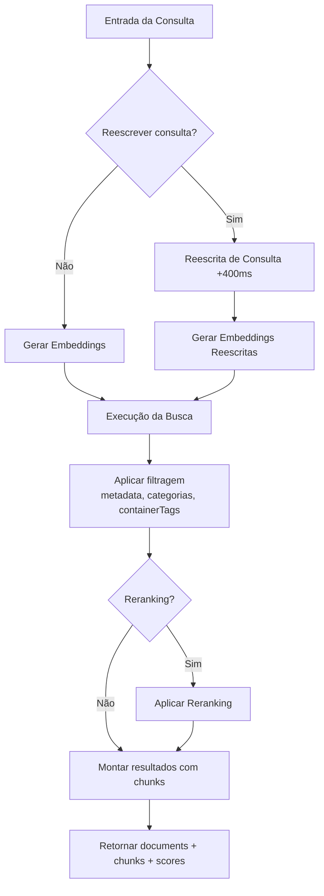
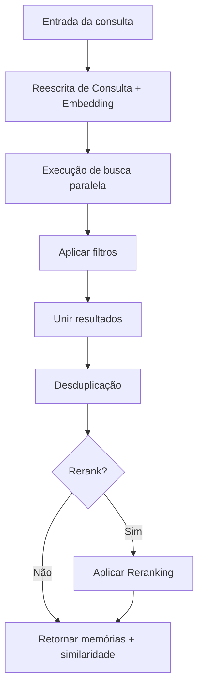

<div id="search-endpoints-overview">
  ## Visão geral dos endpoints de busca
</div>

<CardGroup cols={2}>
  <Card title="Busca de documents - RAG rápido e avançado" icon="settings" href="/pt-BR/search/examples/document-search">
    **POST /v3/search**

    Busca completa com amplo controle sobre ordenação, filtragem, limites e estrutura dos resultados. Pesquisa e retorna documents relevantes. Mais flexibilidade.
  </Card>

  <Card title="Busca de memórias" icon="zap" href="/pt-BR/search/examples/memory-search">
    **POST /v4/search**

    Busca com Latency mínima, otimizada para chatbots e IA conversacional. Pesquisa e retorna memórias. Parâmetros simples, respostas rápidas, fácil de usar.
  </Card>
</CardGroup>

<div id="documents-vs-memories-search-whats-the-difference">
  ## Pesquisa em Documents vs Memories: Qual é a diferença?
</div>

A principal diferença entre `/v3/search` e `/v4/search` é **documents vs memories**. `/v3/search` pesquisa em documents e retorna chunks correspondentes, enquanto `/v4/search` pesquisa nas memórias, preferências e histórico do usuário.

* **Documents:** Referem-se aos dados que você ingere, como texto, PDFs, vídeos, imagens etc. São fontes de verdade.
* **Memories:** São extraídas automaticamente dos seus documents pelo Supermemory. São chunks menores de informação inferidos a partir de documents e relacionados entre si.

Consulte o [guia de ingestão](/pt-BR/memory-api/ingesting) para saber mais sobre a diferença entre documents e memórias.

<div id="documents-search-v3search">
  ### Busca em documents (`/v3/search`)
</div>

**Busca de documents de alta qualidade** — parâmetros abrangentes para ajustar finamente o comportamento da busca:

* **Casos de uso**: Use este endpoint para situações em que é necessária uma busca “literal” em documents.
  * Análise de documentos jurídicos/financeiros
  * Pesquisa de itens no Google Drive
  * Chat com documentação
* Com este endpoint, você tem **controle total** sobre:
  * Limiares (thresholds),
  * Filtragem
  * Reranking
  * Reescrita de consulta

<Tabs>
  <Tab title="TypeScript">
    ```typescript
    // Documents search
    const results = await client.search.documents({
      q: "machine learning accuracy",
      limit: 10,
      documentThreshold: 0.7,
      chunkThreshold: 0.8,
      rerank: true,
      rewriteQuery: true,
      includeFullDocs: true,
      includeSummary: true,
      onlyMatchingChunks: false,
      containerTags: ["research"],
      filters: {
        AND: [{ key: "category", value: "ai", negate: false }]
      }
    });
    ```
  </Tab>

  <Tab title="Python">
    ```python
    # Documents search
    results = client.search.documents(
        q="machine learning accuracy",
        limit=10,
        document_threshold=0.7,
        chunk_threshold=0.8,
        rerank=True,
        rewrite_query=True,
        include_full_docs=True,
        include_summary=True,
        only_matching_chunks=False,
        container_tags=["research"],
        filters={
            "AND": [{"key": "category", "value": "ai", "negate": False}]
        }
    )
    ```
  </Tab>

  <Tab title="cURL">
    ```bash
    curl -X POST "https://api.supermemory.ai/v3/search" \
      -H "Authorization: Bearer $SUPERMEMORY_API_KEY" \
      -H "Content-Type: application/json" \
      -d '{
        "q": "machine learning accuracy",
        "limit": 10,
        "documentThreshold": 0.7,
        "chunkThreshold": 0.8,
        "rerank": true,
        "rewriteQuery": true,
        "includeFullDocs": true,
        "includeSummary": true,
        "onlyMatchingChunks": false,
        "containerTags": ["research"],
        "filters": {
          "AND": [{"key": "category", "value": "ai", "negate": false}]
        }
      }'
    ```
  </Tab>
</Tabs>

```json Sample Response

{
  "results": [
    {
      "documentId": "doc_abc123",
      "title": "Fundamentos de Machine Learning",
      "type": "pdf",
      "score": 0.89,
      "chunks": [
        {
          "content": "Machine learning é um subconjunto da inteligência artificial...",
          "score": 0.95,
          "isRelevant": true
        }
      ],
      "metadata": {
        "category": "educação",
        "author": "Dr. Smith",
        "difficulty": "iniciante"
      },
      "createdAt": "2024-01-15T10:30:00Z",
      "updatedAt": "2024-01-20T14:45:00Z"
    }
  ],
  "timing": 187,
  "total": 1
}
```

O endpoint `/v3/search` retorna os documents mais relevantes e os chunks desses documents. Acesse a página do [schema de resposta](/pt-BR/search/response-schema) para entender melhor a estrutura da resposta.

<div id="memories-search-v4search">
  ### Busca em Memórias (`/v4/search`)
</div>

**Pesquise nas memórias do usuário**:

* **Casos de uso**: Use este endpoint quando entender o contexto, as preferências e as memórias do usuário for mais importante do que a busca literal em documentos.
  * Chatbots personalizados (AI Companions)
  * Seleção automática com base no que o usuário deseja
  * Definição do tom da conversa

Empresas como a Composio e a [Rube.app](https://rube.app) usam a busca em memórias para permitir que o MCP automatize melhor com base nos prompts anteriores do usuário.

<Info>
  Este endpoint é mais indicado para casos de uso de IA conversacional, como chatbots.
</Info>

<Tabs>
  <Tab title="TypeScript">
    ```typescript
    // Memories search
    const results = await client.search.memories({
      q: "machine learning accuracy",
      limit: 5,
      containerTag: "research",
      threshold: 0.7,
      rerank: true
    });
    ```
  </Tab>

  <Tab title="Python">
    ```python
    # Memories search
    results = client.search.memories(
        q="machine learning accuracy",
        limit=5,
        container_tag="research",
        threshold=0.7,
        rerank=True
    )
    ```
  </Tab>

  <Tab title="cURL">
    ```bash
    curl -X POST "https://api.supermemory.ai/v4/search" \
      -H "Authorization: Bearer $SUPERMEMORY_API_KEY" \
      -H "Content-Type: application/json" \
      -D '{
        "q": "machine learning accuracy",
        "limit": 5,
        "containerTag": "research",
        "threshold": 0.7,
        "rerank": true
      }'
    ```
  </Tab>
</Tabs>

```json Sample Response
{
  "results": [
    {
      "id": "mem_xyz789",
      "memory": "Conteúdo completo da memory sobre aplicações de computação quântica...",
      "similarity": 0.87,
      "metadata": {
        "category": "research",
        "topic": "quantum-computing"
      },
      "updatedAt": "2024-01-18T09:15:00Z",
      "version": 3,
      "context": {
        "parents": [
          {
            "memory": "Discussão anterior sobre fundamentos da teoria quântica...",
            "relation": "extends",
            "version": 2,
            "updatedAt": "2024-01-17T16:30:00Z"
          }
        ],
        "children": [
          {
            "memory": "Perguntas de seguimento sobre algoritmos quânticos...",
            "relation": "derives",
            "version": 4,
            "updatedAt": "2024-01-19T11:20:00Z"
          }
        ]
      },
      "documents": [
        {
          "id": "doc_quantum_paper",
          "title": "Aplicações de Computação Quântica",
          "type": "pdf",
          "createdAt": "2024-01-10T08:00:00Z"
        }
      ]
    }
  ],
  "timing": 156,
  "total": 1
}

```

O endpoint `/v4/search` pesquisa e retorna memórias.

<div id="search-flow-architecture">
  ## Arquitetura do Fluxo de Pesquisa
</div>

<div id="document-search-v3search-flow">
  ### Fluxo de Pesquisa de Documentos (`/v3/search`)
</div>



<div id="memory-search-v4search-flow">
  ### Fluxo de busca de memory (`/v4/search`)
</div>



<div id="key-concepts-you-need-to-understand">
  ## Conceitos fundamentais que você precisa entender
</div>

<div id="1-thresholds-sensitivity-control">
  ### 1. Limiares (Controle de sensibilidade)
</div>

Os limiares equilibram quantidade e qualidade dos resultados:

* **0,0** = Menor sensibilidade (mais resultados, qualidade inferior)
* **1,0** = Maior sensibilidade (menos resultados, qualidade superior)

```typescript
// Diferentes estratégias de threshold
const broadSearch = await client.search.documents({
  q: "machine learning",
  chunkThreshold: 0.2,      // Retorna mais chunks
  documentThreshold: 0.1    // De mais documents
});

const preciseSearch = await client.search.documents({
  q: "machine learning",
  chunkThreshold: 0.8,      // Apenas chunks altamente relevantes
  documentThreshold: 0.7    // De documents com correspondência mais próxima
});
```

<div id="2-chunk-context-vs-exact-matching">
  ### 2. Contexto do chunk vs. correspondência exata
</div>

Por padrão, o Supermemory retorna chunks **com contexto** (texto ao redor):

```typescript
// Padrão: inclui chunks ao redor para contexto
const contextualResults = await client.search.documents({
  q: "redes neurais",
  onlyMatchingChunks: false  // Padrão
});

// Preciso: apenas o texto que corresponde exatamente
const exactResults = await client.search.documents({
  q: "redes neurais",
  onlyMatchingChunks: true
});
```

### 3. Reescrita de Consulta &amp; Reranking

**Reescrita de Consulta** (+400 ms de Latency):

* Expande sua consulta para encontrar resultados mais relevantes
* &quot;ML&quot; vira &quot;machine learning artificial intelligence&quot;
* Útil para abreviações e termos específicos do domínio

**Reranking**:

* Reavalia os resultados usando um algoritmo diferente
* Mais preciso, porém mais lento
* Recomendado para buscas críticas

<div id="4-container-tags-vs-metadata-filters">
  ### 4. Container Tags vs Metadata Filters
</div>

Dois mecanismos de filtragem diferentes:

Quando usar container tags:

* O grafo de entendimento do usuário é construído com base em container tags. **O grafo é formado com base em container tags.**
  * Container tags são usadas para agrupamento organizacional e correspondência exata.
  * Elas são úteis para categorizar conteúdo e garantir resultados precisos.
    Quando usar metadata filters:
  * Quando você precisa de condições flexíveis além de correspondências exatas.
  * Úteis para filtrar por atributos como data, autor ou categoria.

```typescript
// Container tags: Agrupamento organizacional (correspondência exata do array)
const userContent = await client.search.documents({
  q: "python tutorial",
  containerTag: "user_123"  // Deve corresponder exatamente
});

// Metadata filters: Consultas baseadas em SQL (condições flexíveis)
const filteredContent = await client.search.documents({
  q: "python tutorial",
  filters: JSON.stringify({
    AND: [
      { key: "language", value: "python", negate: false },
      { key: "difficulty", value: "beginner", negate: false }
    ]
  })
});
```
