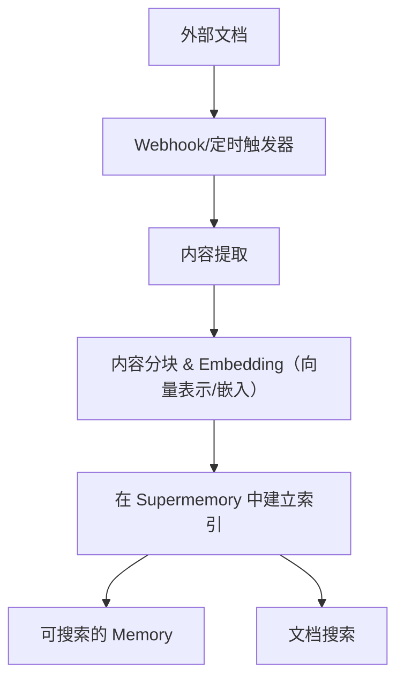

连接外部平台，将 Documents 自动同步到 Supermemory。支持的连接器包括 Google Drive、Notion 和 OneDrive，提供实时同步与智能内容处理。

<div id="supported-connectors">
  ## 支持的连接器
</div>

<CardGroup cols={3}>
  <Card title="Google Drive" icon="google-drive" href="/zh/connectors/google-drive">
    **Google Docs、Slides、Sheets**

    通过 webhooks 实时同步。支持共享云端硬盘、嵌套文件夹和协同文档。
  </Card>

  <Card title="Notion" icon="notion" href="/zh/connectors/notion">
    **页面、数据库、块**

    即时同步工作区内容。支持富格式、嵌入内容和数据库属性。
  </Card>

  <Card title="OneDrive" icon="microsoft" href="/zh/connectors/onedrive">
    **Word、Excel、PowerPoint**

    每 4 小时定时同步。支持个人和企业账户，并提供文件版本控制。
  </Card>
</CardGroup>

<div id="quick-start">
  ## 快速入门
</div>

<div id="1-create-connection">
  ### 1. 创建链接账户
</div>

<CodeGroup>
  ```typescript Typescript
  import Supermemory from 'supermemory';

  const client = new Supermemory({
    apiKey: process.env.SUPERMEMORY_API_KEY!
  });

  const connection = await client.connections.create('notion', {
    redirectUrl: 'https://yourapp.com/callback',
    containerTags: ['user-123', 'workspace-alpha'],
    documentLimit: 5000,
    metadata: { department: 'sales' }
  });

  // 重定向用户以完成 OAuth（开放授权协议）
  console.log('授权 URL：', connection.authLink);
  console.log('有效期：', connection.expiresIn);
  // 输出：授权 URL：https://api.notion.com/v1/oauth/authorize?...
  // 输出：有效期：1 hour
  ```

  ```python Python
  from supermemory import Supermemory
  import os

  client = Supermemory(api_key=os.environ.get("SUPERMEMORY_API_KEY"))

  connection = client.connections.create(
      'notion',
      redirect_url='https://yourapp.com/callback',
      container_tags=['user-123', 'workspace-alpha'],
      document_limit=5000,
      metadata={'department': 'sales'}
  )

  # 重定向用户以完成 OAuth（开放授权协议）
  print(f'授权 URL：{connection.auth_link}')
  print(f'有效期：{connection.expires_in}')
  # 输出：授权 URL：https://api.notion.com/v1/oauth/authorize?...
  # 输出：有效期：1 hour
  ```

  ```bash cURL
  curl -X POST "https://api.supermemory.ai/v3/connections/notion" \
    -H "Authorization: Bearer $SUPERMEMORY_API_KEY" \
    -H "Content-Type: application/json" \
    -d '{
      "redirectUrl": "https://yourapp.com/callback",
      "containerTags": ["user-123", "workspace-alpha"],
      "documentLimit": 5000,
      "metadata": {"department": "sales"}
    }'

  # 响应：{
  #   "authLink": "https://api.notion.com/v1/oauth/authorize?...",
  #   "expiresIn": "1 hour",
  #   "id": "conn_abc123",
  #   "redirectsTo": "https://yourapp.com/callback"
  # }
  ```
</CodeGroup>

<div id="2-handle-oauth-callback">
  ### 2. 处理 OAuth 回调
</div>

用户完成 OAuth 后，将自动建立链接账户并开始同步。

<div id="3-monitor-sync-status">
  ### 3. 监控同步状态
</div>

<CodeGroup>
  ```typescript Typescript
  import Supermemory from 'supermemory';

  const client = new Supermemory({
    apiKey: process.env.SUPERMEMORY_API_KEY!
  });

  // 使用 SDK 列出所有链接账户
  const connections = await client.connections.list({
    containerTags: ['user-123', 'workspace-alpha']
  });

  connections.forEach(conn => {
    console.log('Connection:', conn.id);
    console.log('Provider:', conn.provider);
    console.log('Email:', conn.email);
    console.log('Created:', conn.createdAt);
  });

  // 使用 SDK 列出已同步的 Documents（记忆存储）
  const memories = await client.memories.list({
    containerTags: ['user-123', 'workspace-alpha']
  });

  console.log(`已同步 ${memories.memories.length} 个 documents`);
  // 输出：已同步 45 个 documents
  ```

  ```python Python
  from supermemory import Supermemory
  import os

  client = Supermemory(api_key=os.environ.get("SUPERMEMORY_API_KEY"))

  # 使用 SDK 列出所有链接账户
  connections = client.connections.list(
      container_tags=['user-123', 'workspace-alpha']
  )

  for conn in connections:
      print(f'Connection: {conn.id}')
      print(f'Provider: {conn.provider}')
      print(f'Email: {conn.email}')
      print(f'Created: {conn.created_at}')

  # 使用 SDK 列出已同步的 Documents（记忆存储）
  memories = client.memories.list(container_tags=['user-123', 'workspace-alpha'])

  print(f'已同步 {len(memories.memories)} 个 documents')
  # 输出：已同步 45 个 documents
  ```

  ```bash cURL
  # 列出所有链接账户
  curl -X POST "https://api.supermemory.ai/v3/connections/list" \
    -H "Authorization: Bearer $SUPERMEMORY_API_KEY" \
    -H "Content-Type: application/json" \
    -d '{"containerTags": ["user-123", "workspace-alpha"]}'

  # 响应：[{"id": "conn_abc", "provider": "notion", "email": "user@example.com", ...}]

  # 列出已同步的 Documents
  curl -X POST "https://api.supermemory.ai/v3/documents/list" \
    -H "Authorization: Bearer $SUPERMEMORY_API_KEY" \
    -H "Content-Type: application/json" \
    -d '{"containerTags": ["user-123", "workspace-alpha"]}'

  # 响应：{"results": [...], "totalCount": 45}
  ```
</CodeGroup>

<div id="how-connectors-work">
  ## 连接器如何工作
</div>

<div id="authentication-flow">
  ### 身份验证流程
</div>

1. **创建链接账户**：调用 `/v3/connections/{provider}` 获取 OAuth（开放授权协议）URL
2. **用户授权**：将用户重定向以完成 OAuth 流程
3. **自动配置**：链接账户建立后立即开始同步
4. **持续同步**：通过 webhooks 实时更新，并每 4 小时进行一次定时同步

<div id="document-processing-pipeline">
  ### 文档处理流水线
</div>



<div id="sync-mechanisms">
  ### 同步机制
</div>

| provider | 实时同步 | 定时同步 | 手动同步 |
|----------|---------------|----------------|-------------|
| **Google Drive** | ✅ Webhooks（7 天到期） | ✅ 每 4 小时 | ✅ 按需触发 |
| **Notion** | ✅ Webhooks | ✅ 每 4 小时 | ✅ 按需触发 |
| **OneDrive** | ✅ Webhooks（30 天到期） | ✅ 每 4 小时 | ✅ 按需触发 |

<div id="connection-management">
  ## 链接账户管理
</div>

<div id="list-all-connections">
  ### 列出所有链接账户
</div>

<CodeGroup>
  ```typescript Typescript
  import Supermemory from 'supermemory';

  const client = new Supermemory({
    apiKey: process.env.SUPERMEMORY_API_KEY!
  });

  const connections = await client.connections.list({
    containerTags: ['org-123']
  });
  ```

  ```python Python
  from supermemory import Supermemory
  import os

  client = Supermemory(api_key=os.environ.get("SUPERMEMORY_API_KEY"))

  connections = client.connections.list(container_tags=['org-123'])

  for conn in connections:
      print(f"{conn.provider}: {conn.email} ({conn.id})")
      print(f"Documents: {conn.document_limit or 'unlimited'}")
      print(f"Expires: {conn.expires_at or 'never'}")
  # 输出：notion: user@company.com (conn_abc123)
  # 输出：Documents: 5000
  # 输出：Expires: never
  ```

  ```bash cURL
  curl -X POST "https://api.supermemory.ai/v3/connections/list" \
    -H "Authorization: Bearer $SUPERMEMORY_API_KEY" \
    -H "Content-Type: application/json" \
    -d '{"containerTags": ["org-123"]}'

  # 响应：[
  #   {
  #     "id": "conn_abc123",
  #     "provider": "notion",
  #     "email": "user@company.com",
  #     "documentLimit": 5000,
  #     "createdAt": "2024-01-15T10:30:00.000Z"
  #   }
  # ]
  ```
</CodeGroup>

<div id="delete-connections">
  ### 删除链接账户
</div>

<CodeGroup>
  ```typescript Typescript
  import Supermemory from 'supermemory';

  const client = new Supermemory({
    apiKey: process.env.SUPERMEMORY_API_KEY!
  });

  // 使用 SDK 按链接账户 ID 删除
  const result = await client.connections.delete(connectionId);

  console.log('已删除：', result.id, result.provider);
  // 输出：已删除：conn_abc123 notion
  ```

  ```python Python
  from supermemory import Supermemory
  import os

  client = Supermemory(api_key=os.environ.get("SUPERMEMORY_API_KEY"))

  # 使用 SDK 按链接账户 ID 删除
  result = client.connections.delete(connection_id)

  print(f"已删除：{result.id} {result.provider}")
  # 输出：已删除：conn_abc123 notion
  ```

  ```bash cURL
  curl -X DELETE "https://api.supermemory.ai/v3/connections/conn_abc123" \
    -H "Authorization: Bearer $SUPERMEMORY_API_KEY"

  # 响应：{
  #   "id": "conn_abc123",
  #   "provider": "notion"
  # }
  ```
</CodeGroup>