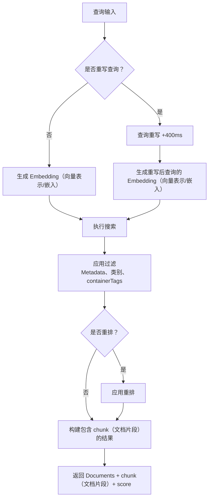
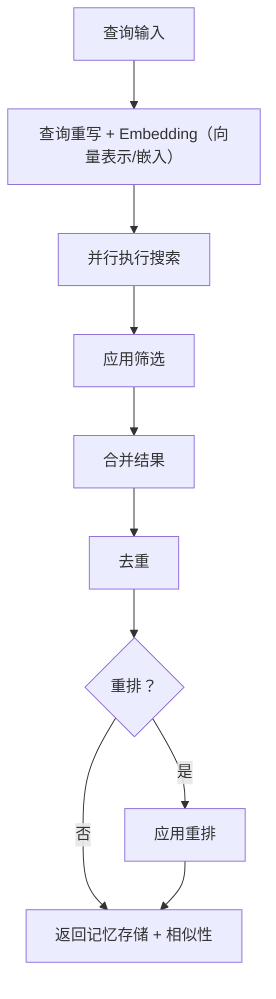

<div id="search-endpoints-overview">
  ## 搜索端点概览
</div>

<CardGroup cols={2}>
  <Card title="Documents 搜索 - 快速、先进的 RAG" icon="settings" href="/zh/search/examples/document-search">
    **POST /v3/search**

    功能齐全的搜索，提供对排序、过滤、最小相似度阈值和结果结构的广泛控制。在 Documents 中检索并返回相关结果，灵活性更高。
  </Card>

  <Card title="Memories 搜索" icon="zap" href="/zh/search/examples/memory-search">
    **POST /v4/search**

    面向聊天机器人与会话式 AI 优化的超低 Latency 搜索。在记忆存储中检索并返回结果。参数简单、响应快速、易于使用。
  </Card>
</CardGroup>

<div id="documents-vs-memories-search-whats-the-difference">
  ## Documents 与 Memories 搜索：有什么不同？
</div>

`/v3/search` 与 `/v4/search` 的关键区别在于 **Documents 与 memories**。`/v3/search` 会在 Documents 中搜索并返回匹配的 chunk（文档片段），而 `/v4/search` 会在用户的 memory、偏好与历史中进行搜索。

* **Documents：** 指你导入的数据，如文本、PDF、视频、图像等。它们是事实依据的来源。
* **Memories：** 由 Supermemory 从你的 Documents 中自动提取。是从 Documents 推断出的、更小且相互关联的信息 chunk（文档片段）。

请参阅[摄取指南](/zh/memory-api/ingesting)以了解 Documents 与 memories 之间的更多差异。

<div id="documents-search-v3search">
  ### Documents 搜索（`/v3/search`）
</div>

**高质量的 Documents 搜索** —— 提供丰富参数以精细调控搜索行为：

* **适用场景**：在需要“精确匹配”的文档搜索时使用此端点。
  * 浏览法律/财务文档
  * 搜索 Google Drive 中的文件
  * 与文档进行对话
* 使用此端点，你可以对以下内容实现**完全控制**
  * 阈值
  * 过滤
  * 重排
  * 查询重写

<Tabs>
  <Tab title="TypeScript">
    ```typescript
    // Documents search
    const results = await client.search.documents({
      q: "machine learning accuracy",
      limit: 10,
      documentThreshold: 0.7,
      chunkThreshold: 0.8,
      rerank: true,
      rewriteQuery: true,
      includeFullDocs: true,
      includeSummary: true,
      onlyMatchingChunks: false,
      containerTags: ["research"],
      filters: {
        AND: [{ key: "category", value: "ai", negate: false }]
      }
    });
    ```
  </Tab>

  <Tab title="Python">
    ```python
    # Documents search
    results = client.search.documents(
        q="machine learning accuracy",
        limit=10,
        document_threshold=0.7,
        chunk_threshold=0.8,
        rerank=True,
        rewrite_query=True,
        include_full_docs=True,
        include_summary=True,
        only_matching_chunks=False,
        container_tags=["research"],
        filters={
            "AND": [{"key": "category", "value": "ai", "negate": False}]
        }
    )
    ```
  </Tab>

  <Tab title="cURL">
    ```bash
    curl -X POST "https://api.supermemory.ai/v3/search" \
      -H "Authorization: Bearer $SUPERMEMORY_API_KEY" \
      -H "Content-Type: application/json" \
      -d '{
        "q": "machine learning accuracy",
        "limit": 10,
        "documentThreshold": 0.7,
        "chunkThreshold": 0.8,
        "rerank": true,
        "rewriteQuery": true,
        "includeFullDocs": true,
        "includeSummary": true,
        "onlyMatchingChunks": false,
        "containerTags": ["research"],
        "filters": {
          "AND": [{"key": "category", "value": "ai", "negate": false}]
        }
      }'
    ```
  </Tab>
</Tabs>

```json Sample Response

{
  "results": [
    {
      "documentId": "doc_abc123",
      "title": "机器学习基础",
      "type": "pdf",
      "score": 0.89,
      "chunks": [
        {
          "content": "机器学习是人工智能的一个分支……",
          "score": 0.95,
          "isRelevant": true
        }
      ],
      "metadata": {
        "category": "教育",
        "author": "Dr. Smith",
        "difficulty": "入门"
      },
      "createdAt": "2024-01-15T10:30:00Z",
      "updatedAt": "2024-01-20T14:45:00Z"
    }
  ],
  "timing": 187,
  "total": 1
}
```

`/v3/search` 端点会返回最相关的 Documents 以及这些 Documents 中的 chunk（文档片段）。前往 [response schema](/zh/search/response-schema) 页面进一步了解响应结构。

<div id="memories-search-v4search">
  ### 记忆搜索（`/v4/search`）
</div>

**在用户记忆中搜索**：

* **适用场景**：当理解用户的上下文 / 偏好 / 记忆比对文档的字面搜索更重要时，请使用此端点。
  * 个性化聊天机器人（AI Companion）
  * 基于用户意图的自动选择
  * 设定对话语气

像 Composio、[Rube.app](https://rube.app) 等公司会使用记忆搜索，让 MCP 能根据用户过往提示更好地进行自动化。

<Info>
  此端点最适合用于聊天机器人等对话式 AI 场景。
</Info>

<Tabs>
  <Tab title="TypeScript">
    ```typescript
    // Memories search
    const results = await client.search.memories({
      q: "machine learning accuracy",
      limit: 5,
      containerTag: "research",
      threshold: 0.7,
      rerank: true
    });
    ```
  </Tab>

  <Tab title="Python">
    ```python
    # Memories search
    results = client.search.memories(
        q="machine learning accuracy",
        limit=5,
        container_tag="research",
        threshold=0.7,
        rerank=True
    )
    ```
  </Tab>

  <Tab title="cURL">
    ```bash
    curl -X POST "https://api.supermemory.ai/v4/search" \
      -H "Authorization: Bearer $SUPERMEMORY_API_KEY" \
      -H "Content-Type: application/json" \
      -D '{
        "q": "machine learning accuracy",
        "limit": 5,
        "containerTag": "research",
        "threshold": 0.7,
        "rerank": true
      }'
    ```
  </Tab>
</Tabs>

```json Sample Response
{
  "results": [
    {
      "id": "mem_xyz789",
      "memory": "关于量子计算应用的完整 memory 内容……",
      "similarity": 0.87,
      "metadata": {
        "category": "research",
        "topic": "quantum-computing"
      },
      "updatedAt": "2024-01-18T09:15:00Z",
      "version": 3,
      "context": {
        "parents": [
          {
            "memory": "此前关于量子理论基础的讨论……",
            "relation": "extends",
            "version": 2,
            "updatedAt": "2024-01-17T16:30:00Z"
          }
        ],
        "children": [
          {
            "memory": "关于量子算法的后续问题……",
            "relation": "derives",
            "version": 4,
            "updatedAt": "2024-01-19T11:20:00Z"
          }
        ]
      },
      "documents": [
        {
          "id": "doc_quantum_paper",
          "title": "量子计算的应用"
          "type": "pdf",
          "createdAt": "2024-01-10T08:00:00Z"
        }
      ]
    }
  ],
  "timing": 156,
  "total": 1
}

```

`/v4/search` 端点用于搜索并返回记忆存储。

<div id="search-flow-architecture">
  ## 搜索流程架构
</div>

<div id="document-search-v3search-flow">
  ### 文档搜索（`/v3/search`）流程
</div>



<div id="memory-search-v4search-flow">
  ### memory 搜索（`/v4/search`）流程
</div>



<div id="key-concepts-you-need-to-understand">
  ## 你需要掌握的关键概念
</div>

<div id="1-thresholds-sensitivity-control">
  ### 1. 阈值（敏感度控制）
</div>

阈值用于在结果的质量与数量之间进行权衡：

* **0.0** = 最低敏感度（返回更多结果，但质量较低）
* **1.0** = 最高敏感度（返回更少结果，但质量更高）

```typescript
// 不同的阈值策略
const broadSearch = await client.search.documents({
  q: "machine learning",
  chunkThreshold: 0.2,      // 返回更多 chunk（文档片段）
  documentThreshold: 0.1    // 覆盖更多 Documents
});

const preciseSearch = await client.search.documents({
  q: "machine learning",
  chunkThreshold: 0.8,      // 仅返回高度相关的 chunk（文档片段）
  documentThreshold: 0.7    // 来自更高匹配度的 Documents
});
```

<div id="2-chunk-context-vs-exact-matching">
  ### 2. chunk（文档片段）上下文 vs 精确匹配
</div>

默认情况下，Supermemory 会返回**带上下文**（周边文本）的 chunk（文档片段）：

```typescript
// 默认：包含用于上下文的相邻 chunk（文档片段）
const contextualResults = await client.search.documents({
  q: "neural networks",
  onlyMatchingChunks: false  // 默认
});

// 精确：仅返回与查询精确匹配的文本
const exactResults = await client.search.documents({
  q: "neural networks",
  onlyMatchingChunks: true
});
```

<div id="3-query-rewriting-reranking">
  ### 3. 查询重写与重排
</div>

**查询重写**（+400ms Latency）：

* 扩展查询以覆盖更多相关结果
* “ML” 会扩展为 “machine learning artificial intelligence”
* 对缩写和领域术语尤其有效

**重排**：

* 使用不同的算法对结果重新评分
* 更准确但速度较慢
* 建议用于关键性搜索

<div id="4-container-tags-vs-metadata-filters">
  ### 4. 容器标签 vs Metadata 筛选器
</div>

两种不同的筛选机制：

何时使用容器标签：

* 用户理解图构建于容器标签之上。**该图基于容器标签构成。**
  * 容器标签用于组织分组和精确匹配。
  * 它们有助于对内容进行分类并确保结果精确。
    何时使用 Metadata 筛选器：
  * 当你需要超出精确匹配的更灵活条件时。
  * 适用于按日期、作者或类别等属性进行筛选。

```typescript
// 容器标签：用于组织分组（要求精确数组匹配）
const userContent = await client.search.documents({
  q: "python tutorial",
  containerTag: "user_123"  // 必须精确匹配
});

// Metadata 过滤器：基于 SQL 的查询（条件更灵活）
const filteredContent = await client.search.documents({
  q: "python tutorial",
  filters: JSON.stringify({
    AND: [
      { key: "language", value: "python", negate: false },
      { key: "difficulty", value: "beginner", negate: false }
    ]
  })
});
```
